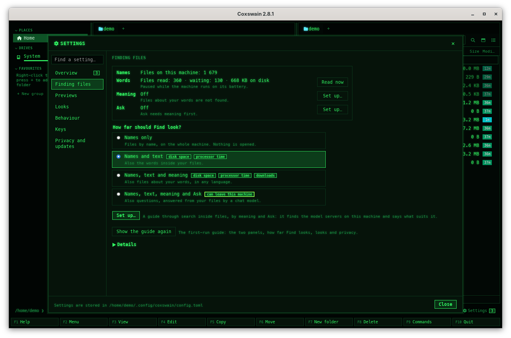

[← README](../../README.md) · [Docs index](../README.md) · [Search](README.md)

# Battery

While a laptop runs on its battery, the [search helper](helper.md) does not read files, hash them
or make vectors: it waits until the mains is back, so search does not drain the battery. Searching
itself goes on as usual.

## How to use it

Nothing to do. To read anyway, on battery:

1. Open *Settings → Finding files* (**Ctrl+,**).
2. Press **Read now** on the *Words* line (or under *Details → Background reading*). The helper reads the backlog at full speed, without rests, until it is
   done, and makes the vectors too.

The terminal app has no Read now; plug in, or use the desktop app's Settings.

## What you see

| Where | What |
|---|---|
| *Settings → Finding files* | Under the *Words* line of the status: *Paused while the machine runs on its battery.*, with **Read now** beside it |
| Find | The count line's ` · 412 still to read` stops counting down |

The name index, the file watcher and every search work as usual.

## How it knows

Whether the machine is on battery is asked at most every thirty seconds:

| System | Asks |
|---|---|
| FreeBSD | `sysctl hw.acpi.acline`: `0` is on battery; without ACPI power reporting, never |
| NetBSD | envstat(8): an `acpiacad` adapter whose `connected` is `FALSE` (`OFF` from older envstat); without one, never |
| OpenBSD | `sysctl hw.power`: `0` is on battery |
| illumos | `kstat -p acpi_drv:0:power`: `system power` is `battery`; without that kstat (servers), never |
| Linux | `/sys/class/power_supply`: a supply of type `Battery`, and no mains supply `online`; without a mains entry, a battery that is `Discharging` |
| Termux on Android | `termux-battery-status` (Termux:API), when it is installed: `UNPLUGGED` is on battery; else as on Linux ([Termux](../reference/termux.md#clipboard-and-battery-termuxapi)) |
| macOS | `pmset` |
| Windows | The system's power status |

## Settings and config.toml

None: there is no key to read on battery all the time. **Read now** reads anyway, until the
backlog is done.

## In the terminal app

The same helper, so the same pause. The terminal app does not show that it is paused; the
backlog simply waits.

## Questions

#### My desktop PC says it is paused for battery.
It reports a battery (a UPS can look like one). Press **Read now**, or check what
`/sys/class/power_supply` lists: a `Battery` with no mains supply `online`.

#### Does search stop working on battery?
No. Names, text and meaning are all searched as usual. Only reading new and changed files, hashing
them and making vectors wait.

#### I pressed Read now on battery. Does it stay on?
Until the backlog is done. After that, new files wait for the mains again.

#### Does the file watcher still follow changes on battery?
Yes, for names: a new file is found by name within a second. Its text is read once the mains is
back.

#### Why does it check only every thirty seconds?
Asking costs a little each time, and a pause that starts half a minute late costs nothing.

---
[← Previous: The search helper](helper.md) · [Next: Notices and what's new →](notices.md)
