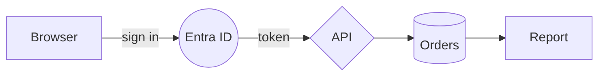
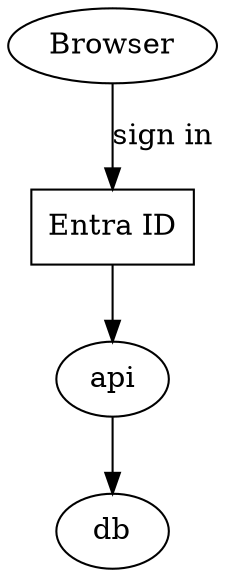

[← README](../../README.md) · [Docs index](../README.md) · [Search](README.md)

# Diagrams read as sentences

A diagram is read as what it says, not only as the words in its boxes: every arrow becomes a
sentence, "Browser to Entra ID: sign in.", with the names the boxes show rather than their ids. So
a [search by meaning](meaning.md) for "entra auth flow" finds the sequence diagram of your login,
and a search by words for `browser entra` finds it too.

<!-- screenshot: search-find-groups.png: the desktop app (Cyber), Find with "engine" typed: In files with main.rs, sequence.puml, launch-pad.drawio and their passages, "engine" highlighted, then History -->
*A PlantUML file found by its words. The sentences made from its arrows are searched the same way.*

## Contents

- [How to use it](#how-to-use-it)
- [What a diagram becomes](#what-a-diagram-becomes)
- [What you see](#what-you-see)
- [Limits](#limits)
- [Settings and config.toml](#settings-and-configtoml)
- [In the terminal app](#in-the-terminal-app)
- [Questions](#questions)

## How to use it

Nothing to turn on. Every diagram in a [folder read](folders.md) is read with its sentences, and
the diagrams read before this came in are read again once, by themselves.

1. **Ctrl+F** for [Find file](find-file.md) (or **Shift+F7** for its *In files* kind).
2. Type who talks to whom: `browser entra`, or with search by meaning on, a question such as
   `how does the app sign in`.

| Kind | Files |
|---|---|
| draw.io | `.drawio` `.dio` (and each page of one) |
| Mermaid | `.mmd` `.mermaid`, and every ` ```mermaid ` block in Markdown (`.md` `.markdown` `.mdx`) |
| Graphviz | `.dot` `.gv` |
| PlantUML | `.puml` `.plantuml` `.pu` `.iuml` `.wsd` |

## What a diagram becomes

The diagram's own text is kept as it is; the sentences come before it, one per line, so that
search by meaning, which reads the start of a file, sees them in a long file too. The
examples come from Coxswain's own tests.

**Mermaid flowchart**



becomes

```text
Browser to Entra ID: sign in.
Entra ID to API: token.
API to Orders.
Orders to Report.
```

Both ways of labelling an arrow are read (`-->|label|` and `-- label -->`), and a chain
`A --> B --> C` gives a sentence per step. `%%` comments are skipped.

**Mermaid sequence diagram**: `participant U as User` gives `U` its name, and each message is a
sentence.

```text
U->>E: authorize          User to Entra ID: authorize.
E-->>U: code              Entra ID to User: code.
U->>+API: exchange code   User to API: exchange code.
```

**Graphviz**: nodes are named by their `label`, and an edge's label ends its sentence.



becomes `Browser to Entra ID: sign in.`, `Entra ID to api.`, `api to db.`

**PlantUML**: names from `participant "Web app" as W` (and `actor`, `component`, `database` …);
`[Entra ID]` components by their name; an arrow pointing left is said the other way round.

```text
User -> W : opens                 User to Web app: opens.
W --> [Entra ID] : redirects      Web app to Entra ID: redirects.
W <- [Entra ID] : token           Entra ID to Web app: token.
```

**draw.io**: when a page is read, each arrow joining two shapes that have labels becomes
`<shape> to <shape>: <arrow label>.`, whether the label is written on the arrow or in a text cell
on it: `Browser to Entra ID: sign in.`, `Entra ID to API: token.` HTML in labels is read as its words.

## What you see

A hit in a diagram shows the passage that matched, as any [text hit](text.md#what-you-see): it may
be the diagram's own text or one of its sentences. A file found by meaning alone is under *About this*, with the
start of the passage in italics. To see the diagram itself, **Enter** to go to it and **Space** for the
[preview](../previews/diagrams.md).

## Limits

- The patterns follow common lines, not the full grammars. A line they do not know adds no
  sentence; the diagram's text is always kept, so its words are still found.
- At most 2,000 sentences per diagram: a generated graph can have thousands of arrows.
- In draw.io, an arrow whose ends are not both shapes with labels gives no sentence.
- Search by meaning gives vectors to the whole text, up to 256 passages of about 120 words. The
  sentences come first, so a diagram is found by its arrows even in a file longer than that; a
  generated graph with thousands of arrows can take most of those passages itself (its words are
  still found by words).

## Settings and config.toml

None. It follows *Words inside files* (`search.text`) and the [folders read](folders.md).

## In the terminal app

The same: the helper reads diagrams for both apps.

## Questions

#### Why does a search for "browser entra" find my diagram, when no box says both?
The arrow from *Browser* to *Entra ID* became the sentence "Browser to Entra ID: …", which has both
words.

#### Do I have to do anything for old diagrams?
No. The first time a helper with this reader runs, every diagram and Markdown file is read again
once, by itself; the rest of the store stays.

#### Does a Mermaid block in my README count?
Yes, a fenced block that starts with ` ```mermaid ` (or `~~~mermaid`). An arrow written in the
Markdown text outside such a block is not read as one.

#### Why is one arrow missing from the sentences?
Its line has a form the patterns do not know, or in draw.io one of its ends is not a shape with a
label. Its words are still in the text. Tell us the line, so the pattern can learn it.

#### Why are ids shown instead of names?
A node that is never given a label is named by its id: `api to db.` in the Graphviz example, where
`api` and `db` have no `label`.

#### Why does search by meaning not find a large diagram by its text?
Only the start of each file gets vectors, and the sentences come first: a graph with hundreds
of arrows fills that start with them. Search by words still finds the text.

#### Is this the same as the diagram preview?
No. The [preview](../previews/diagrams.md) draws the diagram; this reads it for search. They work
apart.

---
[← Previous: Scans, pictures and older Office files](scans.md) · [Next: Git history in search →](history.md)
