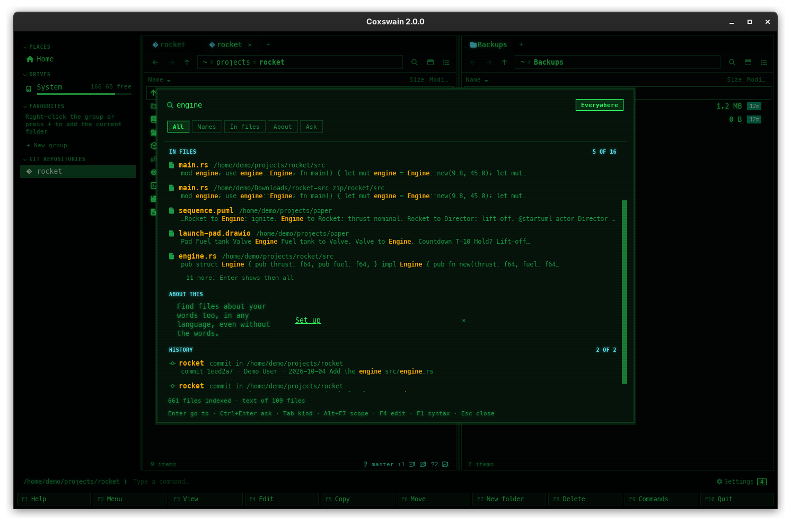

[← README](../../README.md) · [Docs index](../README.md) · [Search](README.md)

# Documents it reads

[Text in files](text.md) reads more than plain text: PDFs, Word and OpenDocument files,
spreadsheets, slides, mail, books, notebooks and diagrams. Coxswain reads all of these itself,
in pure Rust, starting no other program, so a search finds the words in them like the words in
code.

*One search finds the word in code, a diagram, YAML, a log, a mail and a LaTeX file.*

## How to use it

Nothing to do: every file of these kinds inside a [folder read](folders.md) is read by the
[search helper](helper.md). Search it with **Shift+F7** (or **Ctrl+Shift+F** in the desktop app) and your words.

## Formats

| Kind | Files | What is read |
|---|---|---|
| PDF | `.pdf` | The text; a very long document is read for three seconds, which is most of it. A PDF without text is a scan: see [Scans](scans.md) |
| Word and OpenDocument text | `.docx` `.docm` `.dotx` `.odt` `.ott` | The text, with headers, footers, footnotes and comments |
| Rich text | `.rtf` | The text |
| Spreadsheets | `.xlsx` `.xlsm` `.xlsb` `.xls` `.ods` | Every sheet: the values, not the formulas |
| Presentations | `.pptx` `.ppsx` `.potx` `.odp` | The slides, with the speaker notes |
| Mail | `.eml` `.mbox` | Subject, sender, receivers, the message and the names of its attachments |
| Books and web pages | `.epub` `.html` `.htm` `.xhtml` | The text, without the markup |
| Notebooks | Jupyter `.ipynb` | The cells, with what they printed |
| Diagrams | draw.io `.drawio` `.dio`, Mermaid `.mmd` `.mermaid`, Graphviz `.dot` `.gv`, PlantUML `.puml` `.plantuml` `.pu` `.iuml` `.wsd` | The words in the boxes, and [a sentence per arrow](diagrams.md) |
| Markdown | `.md` `.markdown` `.mdx` | The text, and a sentence per arrow of each Mermaid block |
| Plain text | Everything else that is text: code, CSV, JSON, logs, `.tex` … | As it stands |

Older formats (`.doc`, `.ppt`, Publisher, Visio, Apple's `.pages` and `.key`) and the words in
pictures need a program you install: see [Scans, pictures and older Office files](scans.md).

## What you see

A hit in a document looks like any text hit: the name, the folder, and the passage with your
words highlighted. Text is tidied first: runs of spaces become one space, blank lines one line
break, so passages from a spreadsheet or a slide read as a line of words.

## Settings and config.toml

| Key | Type | Default | Does |
|---|---|---|---|
| `search.text_max_size` | bytes | `20971520` (20 MB) | Files larger than this are not read |

The formats themselves cannot be switched off one by one; leave a folder out instead
([Choosing the folders](folders.md)). At most 4 MB of text is kept from one file, and at most
64 MB is unpacked from one part of a zipped document (`.docx`, `.xlsx`, `.epub` …); neither is
a setting.

## In the terminal app

The same: the helper reads the documents for both apps.

## Questions

#### Why is a Word document not found by its text?
Check that it is `.docx` (or `.odt` …), not the older `.doc`: that one needs
[LibreOffice](scans.md). Check that it is smaller than 20 MB, not locked with a password, and in a
[folder read](folders.md).

#### Does it find the formulas in my spreadsheet?
No, the values: what the cells show. A formula's result is found; the formula is not.

#### Are the attachments of a mail read?
Their names are, so `budget.xlsx` finds the mail that had it attached. Their contents are not.

#### Does it read `.tex`, CSV and JSON?
Yes, as plain text, like code and Markdown.

#### Why does a long PDF miss words near its end?
A PDF is read for at most three seconds, which covers most documents but not every page of a very
long one. Its words are also cut at 4 MB of text.

#### Does opening a document for search change it, or start Word?
No. The readers only read, in Coxswain itself, and touch no network. Only the optional programs of
[Scans](scans.md) are started, and only when installed.

#### A file that failed to read: is it tried again?
Yes, when it changes. Until then it is marked as without text, so the helper does not keep trying.

---
[← Previous: Text in files](text.md) · [Next: Scans, pictures and older Office files →](scans.md)
