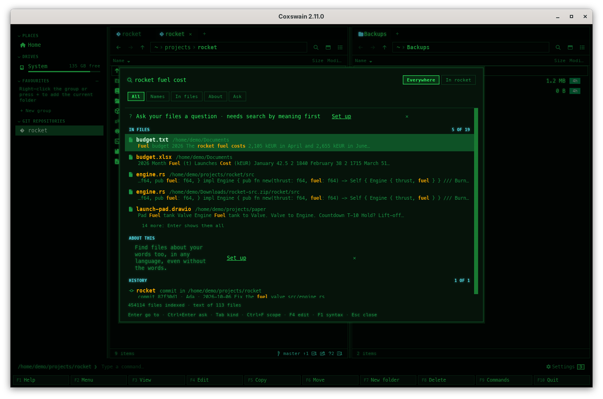

[← README](../../README.md) · [Docs index](../README.md) · [Search](README.md)

# Find

Find is one field for everything you look for: a file's name, words inside files, files
*about* something, and [Ask](ask.md), questions answered from your files. Type, and the hits
come in groups: **Names**, **In files**, **About this** and **History**. Go to one with
**Enter**, or ask with **Ctrl+Enter**.

## Contents

- [How to use it](#how-to-use-it)
- [What you see](#what-you-see)
- [The groups, and their order](#the-groups-and-their-order)
- [Kinds: All, Names, In files, About, Ask](#kinds-all-names-in-files-about-ask)
- [The scope: everywhere or this folder](#the-scope-everywhere-or-this-folder)
- [The Ask row and the answer in place](#the-ask-row-and-the-answer-in-place)
- [Keys](#keys)
- [When something is missing](#when-something-is-missing)
- [Settings and config.toml](#settings-and-configtoml)
- [In the terminal app](#in-the-terminal-app)
- [Questions](#questions)

## How to use it

1. Press **Ctrl+F** or **Alt+F7** (the F9 command list calls it *Find*), or click the
   **⌕** button at the right of a pane's path bar (desktop app). Find opens empty, at *All*,
   searching *Everywhere*.
2. Type: a name (`budget`, `*.pdf`, `ext:md`), words from inside a file (`rocket fuel cost`) or
   a question (`what does the rocket fuel cost?`). The hits update as you type; typing is never
   held up by a search, and a search that a newer one replaces is dropped.
3. Move with **Up** / **Down** (the group headings are skipped) and press **Enter**: the active
   panel opens the hit's folder with the cursor on it, and Find closes.
4. To ask instead, press **Ctrl+Enter** (desktop app) or **Alt+Enter** (terminal app) from any
   row, or **Enter** on the *Ask* row at the top.

To start at one kind: **Shift+F7** (or **Ctrl+Shift+F**) opens Find at *In files*, **Ctrl+F7**
at *Ask*.

## What you see

From the top:

| Part | Desktop app | Terminal app |
|---|---|---|
| The field | ⌕ and the field; empty, it says the scope and the key that changes it: *Find everywhere…   Ctrl+F: only in rocket*, or *Find in rocket…   Ctrl+F: everywhere* | `find: ` and what you typed (`ask: ` in the answer); empty, the same text, dimmed |
| The scope | Two buttons at the right, *Everywhere* and *In rocket* (the active panel's folder); the one in force is lit | `[ everywhere \| in rocket ]` at the right of the field; the one in force is inverted |
| The kinds | Buttons *All · Names · In files · About · Ask*, the current one lit | The same words on the second line, the current one in the cursor colour |
| The list | The *Ask* row, then the groups, each with its heading and *5 of 19* | The same; headings in capitals in the `header` colour |
| Footer, line 1 | What can be searched: *563 files indexed · text of 112 files · meaning for 112*, with *· 412 still to read*, *· building index…* or *· paused on battery* while they apply | The same |
| Footer, line 2 | The keys: *Enter go to · Ctrl+Enter ask · Tab kind · Alt+F7 scope · F4 edit · F1 syntax · Esc close* | The same with *Alt+Enter ask* and *F3 view* |

**Each hit** is the name (bold in the desktop app) and its folder. A hit in *In files* adds the
passage that matched, your words highlighted. A hit in *About this* adds the passage that was
close in meaning, in italics. A commit in *History* names its repository and says which commit.

**Before you type:** *Type a name (\*.pdf, ext:md), words from inside a file, or a question
ending in ?* The first three times Find opens, a dimmed line under it adds *Ctrl+F again
searches only in rocket* (one of the [hints](../panels/action-menu.md#the-hint-in-find)).

**Nothing found:** *Nothing found for "rocket fual".* (*… in rocket.* when the scope is a
folder), with what to try: *Everywhere: Alt+F7* when the scope is a folder, and *Ask instead:
Ctrl+Enter* when Ask is set up.

## The groups, and their order

| Group | What is in it | Searched by |
|---|---|---|
| **Names** | Files and folders whose name matches, on the whole machine or in the scope | The [name index](names.md), with the [name syntax](name-syntax.md) |
| **In files** | Files whose text has your words, best first | [The text of files](text.md); the order takes meaning into account too |
| **About this** | Files close in meaning that lack your words, in any language | [Search by meaning](meaning.md) |
| **History** | Commits whose message, author or paths match | [History in search](history.md) |

**The order follows what you typed**, decided once per query so rows do not jump while results
arrive:

| You type | Example | Groups, in order | Ask row | The cursor starts on |
|---|---|---|---|---|
| Name syntax: `*`, `?` inside a word, `!`, `\|`, `"`, `/`, `\`, `ext:`, `file:`, `folder:`, `case:` | `*.rs`, `ext:md`, `src/ main` | Names only (text and meaning are not searched) | no | the first name |
| One or two plain words | `rocket`, `fuel budget` | Names, In files, About this, History | one word: no; two: yes | the first hit |
| Three plain words or more | `rocket fuel cost` | In files, About this, Names, History | yes | the first hit |
| A question: ends in `?` | `what does the rocket fuel cost?` | In files, About this, Names, History | yes | **the Ask row** |

**How In files is ranked.** The files with every word come first; when fewer than 10 files have
them all, files with any of the longer words (four letters or more) are added, so a question
still finds the file that says "fuel" and "cost". With search by meaning on, a file that has the
words *and* is close in meaning goes ahead of one that only has the words, and a file with only
some of the words stays only when meaning finds it too ([how the two are
fused](meaning.md#how-words-and-meaning-are-ranked-together)).

**In *All***, each group shows its first 5 hits and a last row *14 more: Enter shows them all*.
**Enter** on that row switches to the group's kind, which shows up to 500 hits (desktop app) or
`max_results` (terminal app).

## Kinds: All, Names, In files, About, Ask

| Kind | Shows | Reached by | Prefix |
|---|---|---|---|
| **All** | Every group, five hits each, and the Ask row | Opening with **Ctrl+F** / **Alt+F7**; **Tab** round | none |
| **Names** | Names alone, all of them; never the Ask row | **Tab** | none |
| **In files** | *In files* and *History*, all of them | **Shift+F7** / **Ctrl+Shift+F**; **Tab** | `text:` |
| **About** | Meaning alone: the files closest in meaning, with or without your words | **Tab** | `about:` |
| **Ask** | The answer area: what you type goes to Ask | **Ctrl+F7**; **Tab** | `?` at the start |

**Tab** goes to the next kind, **Shift+Tab** to the one before, round: All → Names → In files →
About → Ask → All. In the desktop app a click on a kind does the same.

**Prefixes** are typed at the start of the field and turn their kind on while they are there:
`text: rocket` searches the words alone, `about: brændstof` meaning alone, `? what does it cost`
asks. They are English in every language, like `ext:`. A `?` anywhere else is the name wildcard
for one character, as before. **Tab** takes the prefix away and moves to the next kind.

## The scope: everywhere or this folder

**Everywhere** searches the whole machine for names, and every [folder read](folders.md) for text
and meaning. **In rocket** (the active panel's folder) limits every group, and Ask, to that
folder and everything below it.

The scope is always on show as a choice of two, at the right of the field:

| | Desktop app | Terminal app |
|---|---|---|
| What you see | Two buttons, **Everywhere** and **In rocket**; the one in force is lit, the other plain. The tooltip of *In rocket* is the whole path and the key | `[ everywhere \| in rocket ]`; the one in force is inverted |
| Switch it | **Ctrl+F** or **Alt+F7** inside Find (the `search` action's keys), or click either button | **Ctrl+F** or **Alt+F7** inside Find |

The empty field says the same in words, with your key: *Find everywhere…   Ctrl+F: only in
rocket*, and after the switch *Find in rocket…   Ctrl+F: everywhere*. A long folder name is cut
short with … in the button.

A folder outside the folders whose text is read shows, under *In files*: */mnt/archive is not
among the folders read, so its words are not searched.* with the step *Read this folder too*. It
adds the folder to `text_roots` (keeping your home folder when the list was empty) and starts
the helper again; the status line says *Reading /mnt/archive too: its words can be found once it
has been read.* (terminal app).

## The Ask row and the answer in place

When the query has two words or more, or ends in `?`, the first row is **? Ask: "rocket fuel
cost"**, with *Ctrl+Enter* at its right in the desktop app. **Enter** on it, or **Ctrl+Enter**
(desktop) / **Alt+Enter** (terminal; **Ctrl+Enter** in terminals that report it) from any row,
sends the query to [Ask](ask.md).

The answer then **replaces the list**, and the *Ask* kind is lit: the question, the answer as it
is written with [1], [2] pointing at its sources, and the numbered sources. The field stays and
takes a follow-up; **Enter** asks it. **Up** / **Down** move over the sources, **Enter** with an
empty field goes to the one under the cursor, **F4** edits it (**F3** views it in the terminal
app). **Esc** goes back to the list; the conversation is kept until Find closes. **Esc** in the
list closes Find and forgets the conversation.

Ask keeps to the scope: *In rocket* asks from the files in that folder only. When nothing there
is close: *Nothing in the files in rocket is close to the question.*

![Find with the answer in place: the question rocket fuel cost, the answer citing [1], the numbered sources budget.txt and budget-da.txt, and the line Enter ask, or go to the source](../screenshots/search-ask.png)

## Keys

No key was added or taken: inside Find, keys go by **action**, so your own bindings for
`search`, `search_text` and `ask` work the same way ([Changing keys](../customise/keys.md)).

| Key | Outside Find | Inside Find |
|---|---|---|
| **Ctrl+F**, **Alt+F7** (`search`) | Open Find: *All*, *Everywhere*, empty | Switch the scope: *Everywhere* ⇄ *In <folder>* |
| **Shift+F7**, **Ctrl+Shift+F** (`search_text`) | Open Find at *In files* | *In files*; pressed again, back to *All* |
| **Ctrl+F7** (`ask`) | Open Find at *Ask* | Ask the text in the field; with an empty field, the *Ask* kind |
| **Tab** / **Shift+Tab** | — | The next / the previous kind |
| **Enter** | — | Go to the hit; on the *Ask* row, ask; on *N more*, show the group alone; on a row that says what is missing, take its step |
| **Ctrl+Enter** (desktop), **Alt+Enter** (terminal) | — | Ask the text in the field, from any row; when Ask is not set up, the answer's place says what it needs |
| **Up** / **Down**, **PageUp** / **PageDown** | — | Move over the rows (15 at a time in the desktop app, 10 in the terminal app); headings are skipped |
| **F3** | — | View the hit (terminal app; in the desktop app Find covers the preview) |
| **F4** | — | Edit the hit or source in your editor; Find stays open |
| **F1** | — | The name syntax and the prefixes, in place of the list; **F1** or **Esc** again for the list |
| **Delete** | — | On a tip (*Find files about your words too…*, *Ask your files a question…*): never show it again. The desktop app also has **×** at its right |
| **Esc** | — | In the answer or the syntax: back to the list. In the list: close and forget |
| Mouse (desktop) | The ⌕ button opens Find | A click puts the cursor on a hit, a double-click goes to it; a click on a kind switches it; a click on *Everywhere* or *In rocket* sets the scope |

## When something is missing

Each state says what is missing, why it matters, and one step. *Set up* opens [the setup
guide](setup.md) in the desktop app; in the terminal app **Enter** on it runs `coxswain
--setup-search` in the terminal and comes back to the panels.

| State | Where | Text | Step |
|---|---|---|---|
| The [helper](helper.md) is not running | *In files* | *Words in files cannot be searched now: background reading is not running.* | *Start it*: the helper starts again |
| *Words inside files* is off | *In files* | *Find can also search the words inside your files.* | *Turn on*: the guide |
| The scope is not read | *In files* | */mnt/archive is not among the folders read, so its words are not searched.* | *Read this folder too* |
| Search by meaning is off | *About this* | *Find files about your words too, in any language, even without the words.* | *Set up* (**Delete** or **×**: not again) |
| Search by meaning failed | *About this* | The cause, as the server or model gave it | *Fix* |
| Ask without meaning | the Ask row | *Ask your files a question · needs search by meaning first* | *Set up* (**Delete** or **×**: not again) |
| Ask without a chat model | the Ask row | *Ask your files a question · choose a chat model* | *Set up* (**Delete** or **×**: not again) |
| The chat model cannot answer | the Ask row (red in the answer) | The cause, e.g. *bge-m3 only reads meaning and cannot answer…* | *Set up* |
| Still reading | footer | *· 412 still to read*: results grow while you wait | — |
| The names are still counted | footer | *· building index…*; the list fills itself | — |

A tip sent away with **Delete** is gone in both apps (they share the state file); **Ctrl+F7**
still opens the Ask kind, which then says what Ask needs.

## Settings and config.toml

| Key | Type | Default | Does |
|---|---|---|---|
| `keys.search` | list of keys | `["Alt+F7", "Ctrl+F"]` | Open Find; inside it, switch the scope |
| `keys.search_text` | list of keys | `["Shift+F7", "Ctrl+Shift+F"]` | Open Find at *In files*; inside it, *In files* ⇄ *All* |
| `keys.ask` | list of keys | `["Ctrl+F7"]` | Open Find at *Ask*; inside it, ask |
| `search.max_results` | number | `10000` | Most hits of one group shown alone (the desktop app shows at most 500) |

The rest belong to the groups: see [Search settings](settings.md).

## In the terminal app

The same field, kinds, groups, rows, keys and states, drawn as text in a frame titled
*Find*: the field on the first line with the scope at its right (`[ everywhere | in rocket ]`, the one in force inverted), the kinds on the
second, group headings in capitals, a passage on a second line under its file, two footer lines.
It differs in a few things:

- **Alt+Enter** asks from any row (**Ctrl+Enter** where the terminal reports it; most do not).
- **F3** views a hit; there is no mouse.
- *Set up* runs `coxswain --setup-search` in the terminal, then comes back to the panels.
- **Ctrl+Shift+F** often arrives as **Ctrl+F** (the scope key), so use **Shift+F7** for *In files*.

![The terminal app's Find with "rocket fuel cost" typed, [ everywhere | in rocket ] at the right with everywhere inverted, the kinds line, the Ask row, IN FILES with budget.txt and ABOUT THIS with budget-da.txt](../screenshots/tui-find.png)

## Questions

#### How do I search only this folder?
Press **Ctrl+F** (or **Alt+F7**) again inside Find, or click *In rocket* at the right of the
field (desktop app). The lit button (the inverted word in the terminal app's
`[ everywhere | in rocket ]`) moves to *In rocket*, the empty field reads *Find in rocket…
Ctrl+F: everywhere*, and every group, and Ask, keeps to the active panel's folder and below.
Press the key again, or click *Everywhere*, for the whole machine. Find always opens at
*Everywhere*.

#### How do I search names only?
Press **Tab** once: the *Names* kind shows names alone, all of them, and never the Ask row. A
query with name syntax (`*.pdf`, `ext:md`, `src/ foo`) shows names only by itself.

#### Why did my file show under About this?
It is close in meaning to what you typed but does not have your words: another language
(*brændstof* for *fuel*), other words for the same thing, or a scan. Files that have your words
are under *In files*. See [Search by meaning](meaning.md).

#### Why does the order of the groups change?
It follows what you typed. One or two words look like a name: *Names* first. Three words or more,
or a question, look like something said inside a file: *In files* and *About this* first. Name
syntax shows names only. The order is fixed once per query, so rows never jump while you look.

#### Why is there no Ask row for one word?
One word is almost always a name. Type a second word, end with `?`, or press **Ctrl+Enter**
(desktop) / **Alt+Enter** (terminal), which asks whatever is in the field.

#### Can I search the text of files in one folder only?
Yes: switch the scope with **Ctrl+F** inside Find, then type, or press **Shift+F7** first for *In
files* alone. Only folders whose text is read have words to find; for another one, *Read this
folder too*.

#### Why does it say "showing the first 500", and where are the rest?
In *All* each group shows five; **Enter** on *N more* shows that group alone, up to 500 hits in
the desktop app (so the list stays quick to draw) or `max_results` in the terminal app. The
heading still counts them all (*500 of 1,204*). Type more, or use `ext:` or a path term (`src/`)
to [narrow it](name-syntax.md).

#### Ctrl+Shift+F opens Find at All, not In files, in my terminal. Why?
The terminal sends **Ctrl+Shift+F** the same as **Ctrl+F**. Use **Shift+F7**, or bind
`search_text` to a key your terminal passes on ([Changing keys](../customise/keys.md)).

#### Why does F3 do nothing in the desktop app's Find?
In the desktop app F3 is the preview pane, and Find covers it. Press **Enter** to go to the file,
then **Space** for the [preview](../previews/README.md). **F4** edits a hit in both apps.

#### I sent a tip away by mistake. How do I get it back?
Not from the app: like other [notices](notices.md#i-dismissed-a-tip-by-mistake-can-i-get-it-back),
dismissed tips are remembered in the state file. What they lead to is still there: **Ctrl+F7**
says what Ask needs, and **Set up…** in *Settings → Finding files* or `coxswain --setup-search` set it up.

#### Is there a quicker search for the panel I am in?
[Quick search](../panels/quick-search.md): **Alt+letter** jumps to names starting with what you
type, in the current panel only.

---
[← Previous: Smart search in a few minutes](setup.md) · [Next: Names everywhere →](names.md)
