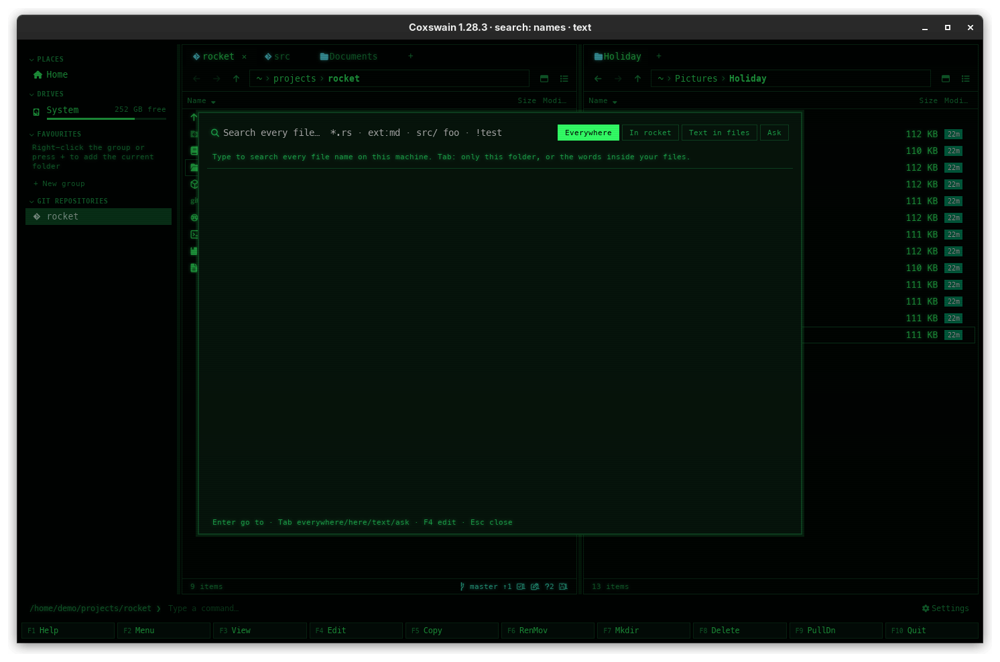

[← README](../../README.md) · [Docs index](../README.md) · [Search](README.md)

# Find file

Find file is one window for four kinds of search: names on the whole machine, names in
this folder, the text inside your files, and [Ask](ask.md), questions answered from them. Open it, type, and go to the file with **Enter**.

*The desktop app searching the text of files. Each hit has its folder and the passage that matched.*

## How to use it

1. Press **Alt+F7** or **Ctrl+F** (the F9 command list calls it *Find file*). It opens at names
   everywhere, every time. To start further in, press **Shift+F7** (or **Ctrl+Shift+F**) for
   *Text in files*, or **Ctrl+F7** for *Ask*.
2. Type. Results update as you type; typing is never held up by a search, however large the
   index, and a search that a newer one replaces is dropped.
3. Press **Tab** to go to the next depth, **Shift+Tab** for the one before. From the last,
   **Tab** goes back to the first; from the first, **Shift+Tab** goes to the last. Or press a
   depth's own key: **Alt+F7** (or **Ctrl+F**) names everywhere, **Shift+F7** text, **Ctrl+F7**
   Ask. What you typed stays in the field and is searched again at the new depth.
4. Move to a result with **Up** / **Down** and press **Enter**: the active panel opens the
   result's folder with the cursor on it, and Find file closes.

| Depth | Its own key | Terminal app prompt | Desktop app button | Finds |
|---|---|---|---|---|
| [Names everywhere](names.md) | **Alt+F7**, **Ctrl+F** | `everywhere: ` | *Everywhere* | Files and folders by name, on the whole machine |
| [Names in this folder](names.md#names-in-this-folder) | none: **Tab** from *Everywhere* | `in ~/projects: ` | *In projects* | The same, in the active panel's folder and below |
| [Text in files](text.md) | **Shift+F7**, **Ctrl+Shift+F** | `text: ` | *Text in files* | Files whose text has your words; with [search by meaning](meaning.md), also files about them |
| [Ask](ask.md) | **Ctrl+F7** | `ask: ` | *Ask* | An answer to your question from the closest passages, with numbered sources |

**Ctrl+Shift+F** is mostly for the desktop app: many terminals send it as **Ctrl+F**, so in the
terminal app it opens names everywhere. **Shift+F7** works in both.

| Key | Desktop app | Terminal app |
|---|---|---|
| **Up** / **Down** | Move through the results | The same |
| **PageUp** / **PageDown** | Fifteen results at a time | Ten results at a time |
| **Enter** | Go to the result | The same |
| **F3** | Nothing: the preview pane is under Find file | View the file in your viewer, then come back to the results |
| **F4** | Edit the file in your editor, Find file stays open | The same |
| **Tab** / **Shift+Tab** | The next / the previous depth, round in a circle | The same |
| **Alt+F7** or **Ctrl+F**, **Shift+F7**, **Ctrl+F7** | Straight to names everywhere, text, Ask; the query stays | The same (**Ctrl+Shift+F** often arrives as **Ctrl+F**) |
| **Backspace** | Delete the last character | The same |
| **Esc** | Close | The same |
| Mouse | A click selects a result, a double-click goes to it; a click on a depth button chooses it | None |

**F3** and **F4** are the *View* and *Edit* actions, and the depth keys are the `search`,
`search_text` and `ask` actions, so if you [change their keys](../customise/keys.md) Find file
follows. **Enter** on a folder opens the folder that holds it, with the cursor on it.

## What you see

**Where it can look.** In the desktop app the four depths are four buttons side by side at the
right of the search field, the current one highlighted: *Everywhere*, *In projects* (the
active panel's folder name), *Text in files* and *Ask*. Hover over one and its tooltip names its
keys: *Alt+F7 · Tab / Shift+Tab* on *Everywhere*, *Shift+F7 · Tab / Shift+Tab* on *Text in
files*, *Ctrl+F7 · Tab / Shift+Tab* on *Ask*, and *Tab / Shift+Tab* on *In projects*. The
terminal app shows the depth as the prompt.

**Before you type**, the line under the field says what the depth does:

| Depth | Desktop app | Terminal app |
|---|---|---|
| Names | *Type to search every file name on this machine. Tab: only this folder, or the words inside your files (Shift+F7).* | `452393 files indexed · Tab: only this folder, or the words inside your files (Shift+F7).` |
| Text | *Type words to search inside your files: text, PDF, Word, spreadsheets, slides, mail and books.* | The count of files with text, then the same sentence |

In text, while [search by meaning](meaning.md) is off, a second line says *Also find files about
your words, in any language:*. The desktop app follows it with the link *turn on search by
meaning*, which opens *Settings → Search by meaning*; the terminal app follows it with the
command, `coxswain --meaning on` (shown while there are no hits).

**While you type**, the line counts: `128 matches in 3.1 ms · 1,402,311 files indexed` for names,
`7 matches in 2.4 ms · text of 31,208 files · 412 still to read` for text. While the first index is
built it adds ` · building index…`; while a fresh one replaces the saved one, ` · refreshing index`.
Nothing found: *No matches*.

**Each result** is the name (bold, in the desktop app) and its folder. A text hit adds the passage
that matched, your words highlighted: a marker in the desktop app, the `search_hit` colour on a
second line in the terminal app. A hit found by meaning starts its passage with *similar to:*.

**How many.** The desktop app lists the first 500 and says *showing the first 500, type more to
narrow*; the terminal app gets up to `max_results` (10,000) and draws what fits.

**The footer** lists the keys: *Enter go to · Tab/Shift+Tab everywhere/here/text/ask · Shift+F7
text · Ctrl+F7 ask · F4 edit · Esc close* (desktop app), `Enter go to · Tab/Shift+Tab
everywhere/here/text/ask · Shift+F7 text · Ctrl+F7 ask · F3 view · F4 edit · Esc close · syntax: F1`
(terminal app). At Ask the footer is Ask's own (see [Ask](ask.md#what-you-see)).

## Settings and config.toml

| Key | Type | Default | Does |
|---|---|---|---|
| `keys.search` | list of keys | `["Alt+F7", "Ctrl+F"]` | The keys that open Find file at names everywhere |
| `keys.search_text` | list of keys | `["Shift+F7", "Ctrl+Shift+F"]` | The keys that open it at *Text in files* |
| `keys.ask` | list of keys | `["Ctrl+F7"]` | The keys that open it at *Ask* |
| `search.max_results` | number | `10000` | Most results of one search (the desktop app shows at most 500 of them) |

The rest are the depths' own: see [Search settings](settings.md).

## In the terminal app

The same window, depths, keys and results, in a frame over the panels titled *Find file*. It
differs in four things: **F3** views a result (the desktop app has the preview pane there
instead), there is no mouse (and so no tooltips on the depths: the footer names the keys), the tip
for search by meaning names the command rather than a link, and **Ctrl+Shift+F** often arrives as
**Ctrl+F**, so use **Shift+F7** for text. **F1** lists the [name syntax](name-syntax.md).

## Questions

#### How do I search only this folder?
Press **Tab** once. *In projects* (the active panel's folder; `in ~/projects:` in the terminal app)
searches that folder and everything below it, by name. See [Names in this folder](names.md#names-in-this-folder).

#### Why does F3 do nothing in the desktop app's Find file?
In the desktop app F3 is the preview pane, and Find file covers it. Press **Enter** to go to the
file, then **Space** for the [preview](../previews/README.md). **F4** edits a result in both apps.

#### Why does Find file start at names everywhere again?
**Alt+F7** (and **Ctrl+F**) opens at the first depth every time, so pressing it then typing
always searches names. Each depth with a key of its own opens at that depth every time:
**Shift+F7** at *Text in files*, **Ctrl+F7** at *Ask*.

#### How do I go straight to searching inside files, or to Ask?
Press **Shift+F7** (or **Ctrl+Shift+F** in the desktop app) for *Text in files*: the prompt is
`text: ` in the terminal app, the *Text in files* button is lit in the desktop app. Press
**Ctrl+F7** for *Ask*. Both work from the panels and from inside Find file, where they keep what
you typed. The F9 command list names them *Search inside files* and *Ask your files*.

#### How do I go back a depth?
**Shift+Tab**. It goes the other way round from **Tab**: Ask → text → this folder → everywhere,
and from *Everywhere* to *Ask*. In the desktop app you can also click the depth's button.

#### Ctrl+Shift+F opens names, not text, in my terminal. Why?
The terminal sends **Ctrl+Shift+F** the same as **Ctrl+F**, so the terminal app sees Find file's
key. Use **Shift+F7**, or bind `search_text` to a key your terminal passes on
([Changing keys](../customise/keys.md)).

#### Can I search the text of files in one folder only?
No. *In projects* narrows names only; *Text in files* covers every [folder read](folders.md). The
folder under each hit shows where it is.

#### Why does it say "showing the first 500"?
The desktop app lists at most 500 hits, so the list stays quick to draw. Type more words, or use
`ext:` or a path term (`src/`) to [narrow it](name-syntax.md).

#### Is there a quicker search for the panel I am in?
[Quick search](../panels/quick-search.md): **Alt+letter** jumps to names starting with what you
type, in the current panel only.

#### What is "similar to:" in front of a passage?
The file was found by [meaning](meaning.md), not by your words. Word hits come first; files
found by meaning come after them.

#### Can I open the file straight from Find file?
**F4** opens it in your editor. **Enter** takes you to it in the panel, where **Enter** again
[opens it](../commands/opening-files.md) with its program.

---
[← Previous: Search](README.md) · [Next: Names everywhere →](names.md)
