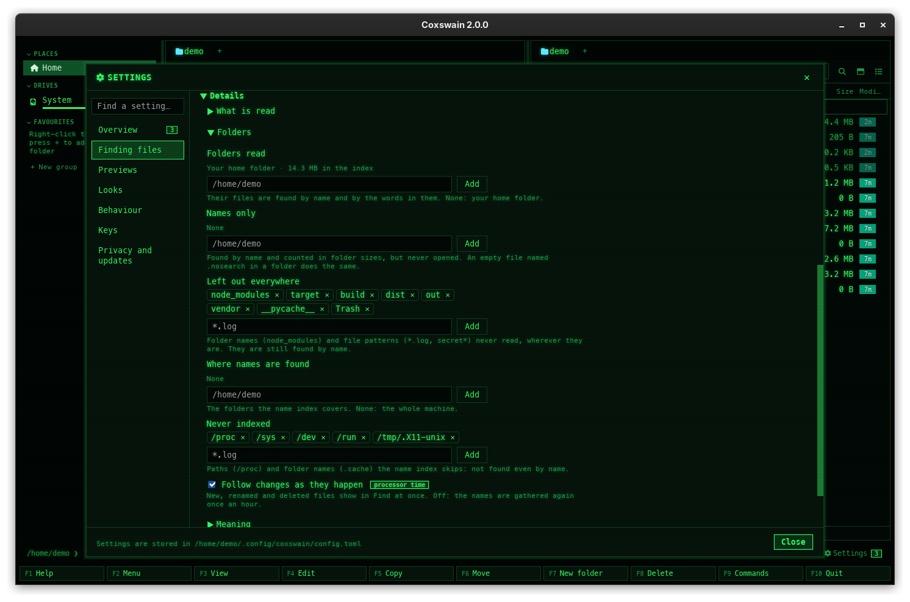

[← README](../../README.md) · [Docs index](../README.md) · [Search](README.md)

# Choosing the folders: folders read, names only, left out, .nosearch

You choose which folders have their text read for [Text in files](text.md), and which are found
by name only. By default it is your home folder, less hidden folders and build output. Use this
to add a data disk, or to keep a mail store or other people's papers out of the index.


*Settings → Finding files, with the lists of folders.*

## How to use it

**Desktop app.** Open Settings (**Ctrl+,**, or start with `coxswain-gui --settings=search`) and go
to *Finding files → Details → Folders*. It has these lists, each with a field and **Add**:

1. Type or paste a folder in the field under *Folders read* or *Names only*. A relative path is
   taken from the active panel's folder; an empty field adds the active panel's folder itself
   (it is shown as the placeholder).
2. Press **Add** (or **Enter** in the field).
3. **Remove** next to a folder takes it off the list.
4. Under *Left out everywhere*, type a folder name (`Mail`) or a file pattern (`*.log`, `secret*`,
   `notes.txt`) and press **Add**: it is never read, wherever it is. The **×** on an entry takes it
   off. The list starts with `node_modules`, `target`, `build`, `dist`, `out`, `vendor`,
   `__pycache__` and `Trash`.

**Any app, any folder.** Put an empty file named `.nosearch` in a folder:
`touch ~/Private/.nosearch`. It does the same as *Names only*, for that folder and all below it.
Delete the file and the folder is read again.

**Folders a program marked as its cache.** A folder holding a `CACHEDIR.TAG` file that starts with
`Signature: 8a477f597d28d172789f06886806bc55` (the [Cache Directory Tagging
Specification](https://bford.info/cachedir/), which backup tools follow too) is read as if it held
`.nosearch`. Cargo puts one in every `target` folder, whatever it is called (`exp5_target`,
`--target-dir`), and other build and cache tools do the same, so build output stays out of the
text and out of search by meaning. A `CACHEDIR.TAG` without that signature changes nothing.

**Terminal app.** Set the lists in `config.toml` (below).

| List | Key | Does |
|---|---|---|
| **Folders read** | `text_roots` | The folders whose files are read. None listed means your home folder. |
| **Names only** | `names_only` | Folders whose files are found by name and counted in folder sizes, but never read: mail stores, archives of other people's documents, anything whose text you do not want in the index |
| `.nosearch` | a file | The same as *Names only*, set from the folder itself |
| `CACHEDIR.TAG` | a file, put there by a program | The same as `.nosearch` when it starts with the specification's signature |
| **Left out everywhere** | `text_exclude` | Folder names and file patterns left out wherever they are. A plain name (`build`) leaves out folders of that name; an entry with `*`, `?` or a dot (`*.log`, `notes.txt`) leaves out files too. `*` stands for any run of characters, `?` for one; the case counts |

Files that are only online in OneDrive, Dropbox, Google Drive, Proton Drive or iCloud are never
read either, wherever they are: they are found by name and left in the cloud, unless you say
otherwise. See [Cloud files](cloud-files.md).

Hidden folders (their names start with a dot) are always left out of reading, and so is
Coxswain's own cache folder (`search.db`, previews, copies looked at) on every system. All of them
are still in the [name index](names.md), and a file left out still counts in folder sizes.

## What you see

Under *Folders read*, each folder shows how much of it is in the index: *412 MB in the index*.
With none listed it says *Your home folder · 412 MB in the index*. A folder on a disk that is not
plugged in says *412 MB in the index, kept while its disk is not plugged in. Remove forgets it.*
(see [Removable disks](removable-disks.md)). *Names only* says *None* while it is empty.

Changing a list starts a new [helper](helper.md) with the new settings: files newly left out go
from the index, files newly included are read, and *waiting* on the *Words* line counts them.

Under *Left out everywhere*: *Folder names (node_modules) and file patterns (*.log, secret*) never
read, wherever they are. They are still found by name.* Under *Names only*: *Found by name and
counted in folder sizes, but never opened. An empty file named .nosearch in a folder does the same.*

Under *Details → Background reading*, the path of the store, `search.db`, with **Show in panel**:
Settings closes and the active panel opens its folder with the cursor on it, so the preview (or
**F3**) shows its tables. With the built-in model for search by meaning, its folder has a **Show in
panel** too, under *Details → Meaning*.

## Settings and config.toml

Under `[search]`:

| Key | Type | Default | Settings item (*Finding files → Details*) |
|---|---|---|---|
| `text_roots` | list of paths | `[]` (your home folder) | *Folders → Folders read* |
| `names_only` | list of paths | `[]` | *Folders → Names only* |
| `text_exclude` | list of strings | `["node_modules", "target", "build", "dist", "out", "vendor", "__pycache__", "Trash"]` | *Folders → Left out everywhere* |
| `text_max_size` | bytes | `20971520` | *What is read → Largest file read (MB)* |

`text_exclude` replaces the default list, so repeat what you want to keep:

```toml
[search]
text_roots = ["/home/me", "/mnt/data"]
names_only = ["/home/me/Mail"]
text_exclude = ["node_modules", "target", "build", "dist", "out", "vendor", "__pycache__", "Trash", "Mail", "*.log"]
text_max_size = 52428800   # 50 MB
```

## In the terminal app

There is no Settings window: edit `config.toml` (its path: `coxswain --config-path`). The helper
reads the config when it starts, so a change made by hand takes effect at its next start (see the
questions). `.nosearch` works the same from any app.

## Questions

#### How do I make a folder names-only?
Desktop app: *Settings → Finding files → Details → Folders → Names only*, type or paste the folder and press
**Add** (or open the folder in the active panel and press **Add** with the field empty). From
anywhere: put an empty file named `.nosearch` in it. In `config.toml`:
`names_only = ["/home/me/Mail"]` under `[search]`.

#### How do I leave out files like `*.log`, or one file?
Add the pattern under *Settings → Finding files → Details → Folders → Left out everywhere* (`*.log`, `*.csv`, `secret*`), or
the file's name (`passwords.txt`): every file that matches, anywhere, loses its text from the
index at the next scan and is never read again. It is still found by name. In `config.toml`, add it
to `text_exclude`.

#### Where is `search.db`, and can I look inside?
In Coxswain's cache folder: `~/.cache/coxswain/search.db` on Linux, `~/Library/Caches/coxswain` on
macOS, `%LOCALAPPDATA%\coxswain` on Windows (`coxswain --paths` prints it). *Settings → Finding
files → Details → Background reading → Show in panel* opens it in the active panel; the preview shows its tables and their
row counts, and **F3** in the terminal app their first rows too, read-only, also while the helper
writes to it. The cache
folder itself is never read into the index, so the store does not index itself.

#### I added a folder outside my home folder, and now my home folder is not read.
Listing folders replaces the default. Add your home folder to *Folders read* too.

#### I changed `[search]` in `config.toml` by hand and nothing happened.
The helper reads the config when it starts. Changes made in Settings restart it; a change made by
hand takes effect when it next starts. Make any change under *Settings → Finding files*, or
close every Coxswain window and wait ten minutes. With the helper started with your session, run
`coxswain --index-service off` and then `on`.

#### Is a names-only folder still in folder sizes?
In [folder sizes](../panels/folder-sizes.md), yes: its files are counted, never read. Its names are
found by [names everywhere](names.md) as before.

#### What happens to text already in the index when I leave a folder out?
It goes from the index when the new helper walks the folders read.

#### Can I read a hidden folder, like `~/.notes`?
No. Hidden folders are always left out of reading. Their files are still found by name.

#### Can I read `node_modules` or `build` after all?
Yes: press its **×** under *Left out everywhere*, or set `text_exclude` without that name. In `config.toml`
the list replaces the default one, so list the others you still want left out.

#### Will adding my OneDrive folder download it?
No. Its files that are only online are found by name and never read, so nothing is downloaded;
the files OneDrive keeps on your disk are read. See [Cloud files](cloud-files.md).

#### Why is a build folder with another name than `target` not read?
Cargo marks each of its build folders with a `CACHEDIR.TAG`, whatever the folder is called, and a
folder with that tag is read as if it held `.nosearch`: its files are found by name and counted in
folder sizes, never read. To read one after all, delete its `CACHEDIR.TAG` (Cargo writes it again
at its next build).

#### Does `.nosearch` hide a folder from name search too?
No, only from reading. To leave a folder out of the name index, use `name_exclude` (see
[Names everywhere](names.md#settings-and-configtoml)).

---
[← Previous: Inside archives](archives.md) · [Next: Cloud files →](cloud-files.md)
