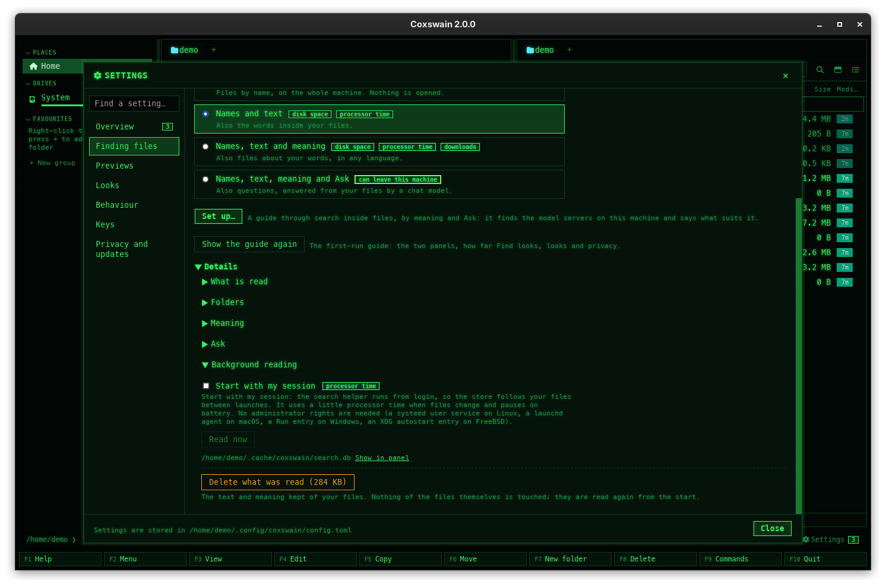

[← README](../../README.md) · [Docs index](../README.md) · [Search](README.md)

# The search helper

The index lives in a helper process that every window and terminal app shares: one index in
memory, one scan of the disk, one `search.db`. It starts with the first app and leaves ten minutes
after the last, or it can start with your session so it reads while no window is open.

## How to use it

Nothing to do: the first app starts it and the others find it. A new window searches at once.

**Start it with my session:**

| Where | How |
|---|---|
| Desktop app | Tick *Settings → Finding files → Details → Background reading → Start with my session* |
| Terminal app | `coxswain --index-service on`; `off` removes it; `coxswain --index-service` alone prints `on` or `off` |

This registers the helper with the system:

| System | Registration |
|---|---|
| Linux | A systemd user unit, `~/.config/systemd/user/coxswain-index.service`, with `Nice=10` and idle I/O |
| macOS | A LaunchAgent, `~/Library/LaunchAgents/dk.mwo.coxswain.index.plist`, with `Nice` 10, which macOS lists under *System Settings → General → Login Items & Extensions* |
| Windows | A *Run* entry, `coxswain-index`, under `HKCU\Software\Microsoft\Windows\CurrentVersion\Run` |
| FreeBSD | An XDG autostart entry, `~/.config/autostart/coxswain-index.desktop`, which the desktop session starts at login; an rc.d script and a login-shell line are the other ways ([FreeBSD](../reference/freebsd.md#the-search-helper)) |

It then starts at login and stays, so the backlog is read before any window is opened. Unticking
it (or `off`) removes the registration and stops the running one; the helper goes back to
starting with the first app and leaving ten minutes after the last.

## What you see

Nothing of its own while it works. Signs of it:

- Find's count line: ` · building index…`, ` · refreshing index`, ` · 412 still to read`.
- *Settings → Finding files*: the *Words* line, *Files read: 31,208 · waiting: 412 · 1.1 GB on
  disk*; *Details → Background reading* shows where `search.db` is. When it cannot be reached, the
  *Words* line says *Not running*, with **Start it** and the note *Background reading is not
  running, so the words in files cannot be searched now.*; **Read now** and **Delete what was
  read** are greyed out.
- In a process list: the app itself, started as `coxswain --index-helper` (or `coxswain-gui
  --index-helper`).

## How it works

- **One for all.** The helper is the app itself, started with `--index-helper`. It holds the
  [name index](names.md), reads [text](text.md), makes [vectors](meaning.md), and keeps
  [folder sizes](../panels/folder-sizes.md) and the hashes for [Duplicates](../files/duplicates.md).
- **Private.** The apps talk to it over a local connection (a loopback TCP port). Its port and a
  random token are in a file only you can read (`index.addr` in the cache folder); a connection
  without the token is dropped.
- **Versions.** A helper of another version steps down for the new one after an update.
- **Upgrades that move the program.** The session registration names the program it starts. An
  upgrade can remove that program: a Homebrew cask keeps the version in its path, and an AppImage
  can be moved or replaced by one with another name. When an app finds no helper answering and
  the registration is not the one it writes (another program, or an older version's), it registers itself instead (it rewrites
  the systemd unit, the LaunchAgent or the *Run* entry) and starts it. You see nothing but search
  working; *Start with my session* stays ticked. Before 1.29.0 the system kept trying the removed
  program, and both apps searched names only, without a word.
- **A name that stays.** From 1.29.1 the registration names the program by a link on your `PATH`
  when there is one (`coxswain-gui` or `coxswain`, as Homebrew puts in its `bin` folder), not by
  the versioned file it points to. After `brew upgrade` the link leads to the new version, so the
  helper that starts with your next login is already the new one, before you open the app.
- **When the system does not start it.** With *Start with my session* on, an app that finds no
  helper asks systemd or launchd to start it (`systemctl --user start coxswain-index`, `launchctl
  kickstart`), and again three seconds later. If none answers eight seconds on, the app starts one
  that stays until you log out, and a notice says so once: *Start with my session is on, but
  macOS did not start the search helper, so Coxswain started it until you log out*, with where to
  allow it. Search works either way. On a Mac this happens when *Allow in the Background* is off
  for Coxswain, or a managed Mac does not allow background items.
- **Its log.** The helper writes when it starts, when and why it leaves, and what failed into
  `helper.log` in the cache folder (`~/Library/Caches/coxswain/` on a Mac, `~/.cache/coxswain/`
  on Linux), readable by you alone. It is emptied when it passes 1 MB. On Linux, systemd keeps
  the session helper's lines in the journal instead: `journalctl --user -u coxswain-index`.
- **Without it.** If the helper cannot be reached, each app indexes names by itself; text search
  and meaning then wait for the helper.
- **Settings.** A change under *Finding files* starts a new helper
  with the new settings.

## Settings and config.toml

| Settings item | Where it is kept | Default |
|---|---|---|
| *Finding files → Details → Background reading → Start with my session* | Not in `config.toml`: the systemd unit, LaunchAgent or *Run* entry itself | Off |

## Check that it runs, and turn it off

| System | What *Start with my session* registers | Check that it runs | Turn it off |
|---|---|---|---|
| Linux | A systemd user service, `coxswain-index.service` | `systemctl --user status coxswain-index` | Untick it, or `coxswain --index-service off` |
| macOS | A LaunchAgent, `~/Library/LaunchAgents/dk.mwo.coxswain.index.plist` | `launchctl print gui/$(id -u)/dk.mwo.coxswain.index` | The same |
| Windows | A *Run* entry for your user in the registry | Task Manager → *Startup apps* lists Coxswain | The same, or disable it in Task Manager |
| FreeBSD | An XDG autostart entry, `~/.config/autostart/coxswain-index.desktop` | `pgrep -lf index-helper` | The same; the running helper stays until you log out |

The [guided setup](setup.md#keep-reading-in-the-background) offers it as its last step but one.

## In the terminal app

The same helper, shared with the desktop app. `coxswain --index-service on|off` does what the
checkbox does. `coxswain --paths` prints where the index, the search store and the model are.

## Questions

#### Is Coxswain running in the background after I close it?
Yes, the helper, for ten minutes, so the next window starts searching at once. Then it exits. With
*Start with my session* it stays for good.

#### How do I stop the helper?
Close every Coxswain window and wait ten minutes. With *Start with my session* on, untick it (or
`coxswain --index-service off`), which also stops the running one. Do not kill it by name: an app
still running would start another.

#### Why start it with my session?
So the first pass over your files, and the vectors for search by meaning, are done while no
window is open. Otherwise reading happens only while an app runs and ten minutes after.

#### Can another user on the machine search my files through it?
No. The port is on loopback only, and a connection must bring the token, which is in a file only
you can read.

#### Two windows are open. Are my files read twice?
No. Both use the one helper: one scan, one store, one index in memory.

#### After an update, the index was built again. Why?
The helper of the old version stepped down for the new one, which loaded the saved index and
refreshed it. The text in `search.db` stays.

#### Search inside files and meaning stopped after an upgrade. Why?
Before 1.29.0: *Start with my session* was on, and the upgrade removed the program the
registration started (a Homebrew path with the old version in it, a moved AppImage). The helper
could not start, so Find found names only: words, meaning and *Ask* found nothing, and
Settings said *The search helper is not running, so text cannot be
searched now.* From 1.29.0 the first app you open registers itself and starts the helper. On an
older version, untick and tick *Start with my session* again, or run `coxswain --index-service off`
then `on`.

#### Start with my session is on, but background reading does not start. Why?
The system did not start the helper, or started it and it left. From 2.1.2 the app then starts it
itself (Find searches words again, and *Settings → Finding files* shows *Files read*), and a
notice in the status line (terminal app) or under *Settings → What's new* (desktop app) says why
and where to allow it. To see what happened:

| System | Look at |
|---|---|
| macOS | `launchctl print gui/$(id -u)/dk.mwo.coxswain.index`: `state = running` and its `pid`, `runs` (how often it started), `last exit code`; and `~/Library/Caches/coxswain/helper.log` |
| Linux | `systemctl --user status coxswain-index` and `journalctl --user -u coxswain-index` |

On a Mac, turn on **System Settings → General → Login Items & Extensions → Coxswain → Allow in the
Background**, then untick and tick *Start with my session* again (or `coxswain --index-service off`
then `on`). Before 2.1.2 the LaunchAgent ran the helper as a background job, which macOS keeps on
the efficiency cores with its disk reads throttled: it ran, but the backlog barely moved. The first
app of 2.1.2 you open rewrites the LaunchAgent without that.

#### What is in helper.log?
One line per start (`helper starts, process 70973`), why it left (*no app asked for a while*, *an
app asked it to*, *another helper runs*), and errors, such as a search store that could not be
opened, each with the time. Nothing about your files.

#### I changed `[search]` by hand. How do I make the helper take it?
Make any change in Settings, or close every window and wait ten minutes; with the session helper,
`coxswain --index-service off` then `on`.

---
[← Previous: Ask](ask.md) · [Next: Battery →](battery.md)
