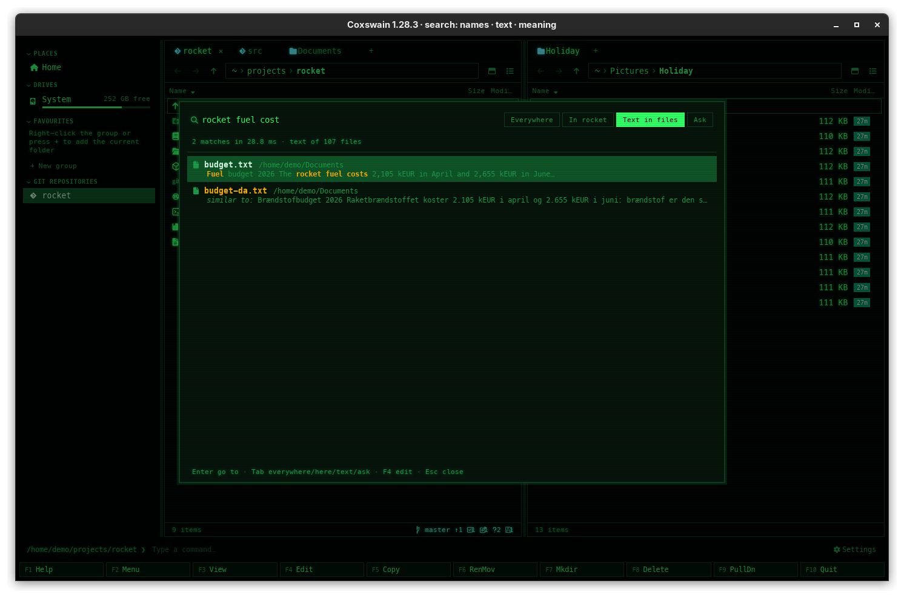

[← README](../../README.md) · [Docs index](../README.md) · [Search](README.md)

# Search by meaning

Words find the files that contain them. Search by meaning also finds the files that are *about*
what you type, whatever words they use and in whichever language: "what the rocket's fuel costs"
finds `Brændstofbudget.docx`. A small multilingual model does it on your own machine; it is off
until you turn it on.



## Contents

- [How to use it](#how-to-use-it)
- [What you see](#what-you-see)
- [How it works](#how-it-works)
- [How words and meaning are ranked together](#how-words-and-meaning-are-ranked-together)
- [On a Mac's GPU](#on-a-macs-gpu)
- [Settings and config.toml](#settings-and-configtoml)
- [In the terminal app](#in-the-terminal-app)
- [Questions](#questions)

## How to use it

**Turn it on** (once). The quickest way is the guided setup, [Smart search in a few
minutes](setup.md): **Set up…** at the top of *Settings → Search by meaning*, or
`coxswain --setup-search`. It finds a model server on your machine and says whether the built-in
model or a server suits it. By hand:

| Where | How |
|---|---|
| Desktop app | *Settings → Search by meaning → Download the model (465 MB) and turn on*. A bar shows *Downloading the model: 120 MB of 465 MB*; **Cancel** stops it |
| Terminal app | `coxswain --meaning on`: prints *Downloading the model for search by meaning: 42%*, then turns it on (with a [server](servers.md) as the engine, nothing is downloaded) |
| A link | *set up search by meaning* under Find file's text depth (it opens the guided setup), and the [notice](notices.md) *New: search by meaning finds files about your words, in any language. Turn it on*: in the desktop app under *Settings → What's new* (**Show me**), in the terminal app once in the status line |

It needs *Search inside files* on: the button is greyed out otherwise. Then:

1. **Shift+F7** (or **Ctrl+Shift+F** in the desktop app) for Find file at *Text in files*.
2. Type a question or a few words, in any language.
3. Files with your words come first; files found by meaning follow.

**Turn it off:** *Turn off* in Settings (or `coxswain --meaning off`) stops it and keeps the model.
**Delete the model** (or `coxswain --meaning delete`) turns it off and deletes the model.
`coxswain --meaning` alone prints `on` or `off`, and with the built-in model a second line with
where it runs: `Built-in model · on the GPU (Metal)`.

## What you see

**In Find file**, a hit found by meaning shows the start of the passage that was closest (up to 24
words), marked *similar to:*, wherever in the document that passage is. Only files close to the
best match are shown (within 0.10 of its score with the built-in model, 0.15 with bge-m3 and
other server models, and above what unrelated text scores: 0.77 and 0.45), so unrelated files
stay out. A file found by both its words and its meaning is shown once, as a word
hit.

**In Settings → Search by meaning**, from top to bottom:

- The hint: *Finds files about what you type, not only files with its words, in any language:
  “rocket fuel cost” finds a Danish budget. A small language model (multilingual-e5-small) runs on
  this machine, slowly and never on battery; nothing leaves it. In Find file, Tab to text: such
  files show as “similar to”.*
- *Vectors made by*: *Built-in model, on this machine (465 MB once)*, *Ollama*, or *A server with the
  OpenAI API (Lemonade, LM Studio, llama.cpp …)*. The last two are on [their own page](servers.md).
- While on: *Understood: 8,120 files · still to go: 23,088*, where the built-in model runs in
  bold (*Built-in model · on the GPU (Metal)*, *Built-in model · on the CPU*, or on a Mac that could
  not use its GPU *Built-in model · on the CPU (this Mac has no Metal GPU to use)*); while the vectors are being
  [renewed](#why-is-search-by-meaning-re-reading-everything), also *Renewing search by meaning
  for whole documents: 23,088 files to go, about 3 hours*; the model in use
  (`builtin:multilingual-e5-small@614241f6`), the model's folder, any error in red, and on battery
  *Paused while the machine runs on its battery. Index now reads anyway.* On a Mac, the switch
  *Use the CPU only*. Buttons **Turn off** and **Delete the model**.
- While off, with the model there: **Turn on** and **Delete the model**. Without it:
  **Download the model (465 MB) and turn on**.

**In the title**: `Coxswain 1.16.0 · search: names · text · meaning` once it runs
([Notices and what's new](notices.md)).

## How it works

- **The model** is [multilingual-e5-small](https://huggingface.co/intfloat/multilingual-e5-small),
  downloaded once from Hugging Face at a pinned version: three files, 488 MB (465 MiB), each checked
  against its SHA-256 before it is used. It is kept in Coxswain's cache folder under
  `models/multilingual-e5-small-614241f6`.
- **It runs on the CPU**, with [candle](https://github.com/huggingface/candle) in pure Rust, on two
  threads, so the machine stays yours, on Linux and Windows. **On a Mac with Apple Silicon it runs
  on the GPU** through Metal ([below](#on-a-macs-gpu)). For a GPU elsewhere, see [servers](servers.md).
- **What gets vectors:** the whole text of each file, in passages of up to 120 words. A passage
  ends at a paragraph's end once it has 60 words; a paragraph longer than that is cut, and the
  next passage starts with the last 20 words of the cut one, so nothing said across a cut is
  lost. In Markdown files (`.md`, `.markdown`, `.mdx`) each heading starts a new passage. A
  passage with fewer than 20 letters is skipped.
- **What the model is shown** of each passage is a first line with the file's name, its folder
  and, in Markdown, the heading it sits under (`budget.md · rocket/notes · Fuel`), then the
  passage. A question that names a file, a folder or a section finds it.
- **The cap:** 256 passages a file, about 25,000 words. Of a longer file, the first 16 passages,
  the last 4, the first passage under each heading (up to 128) and passages spread evenly over
  the rest get vectors; search by words still finds every word. Each vector (384 numbers) is
  packed into a byte a number and kept in `search.db`.
- **When:** the [helper](helper.md) makes them a few files at a time, resting as long as the work
  took, and not on [battery](battery.md) unless you press *Index now*. New and changed files get
  theirs at the helper's next pass, within ten minutes; their words are searchable at once.
- **A search:** your question gets a vector too. A first sieve over one bit per number keeps the
  1,000 closest passages; their full vectors are then scored. A file counts with its best
  passage, and a little more (0.005) for each further passage that is close too, up to four, so
  a document that keeps coming back to your question goes ahead of one that mentions it once.
- **A new way of cutting passages** (as in 1.39.0, which covers whole documents where earlier
  versions took the first 960 words) is noticed when the helper opens `search.db`: it keeps the
  number of the way its vectors were made (`passages` in its table of facts). When that differs,
  the vectors go, the text stays, and every file gets new ones in the background, the last
  changed first. Nothing else is read again. This happens once per store, on whichever machine
  the store is: a copied or synced cache folder is renewed where it is opened.

## How words and meaning are ranked together

A search in the files' text runs two searches: by words (every word, or, when fewer than 10
files have them all, any of the longer words) and by meaning. Their two lists are fused by
**reciprocal rank fusion**: a file scores

```
1 / (60 + its rank among the files with every word)  +  2 / (60 + its rank by meaning)
```

(a term is 0 when the file is not in that list). The files with the words are ordered by this
score, so a file that has the words *and* is close in meaning comes first, and one that has
them all keeps its place among the rest. A file with only some of the words counts by meaning
alone, and is shown only when meaning finds it too. Files found by meaning alone follow, closest
first. The weights were chosen with the [search-quality questions](../reference/performance.md#search-quality):
meaning weighs twice as much as words because, on those questions, it ranks the right file first
more often.

## On a Mac's GPU

On a Mac the built-in model tries Apple's GPU first, through Metal, and makes the vectors there
in batches of up to 32 passages: several times faster than on the CPU (the notice says how much
the probe measured). Nothing changes in what it finds.

**How it decides**, each time the [helper](helper.md) starts:

1. It looks for a Metal GPU. Apple Silicon (M1 and later) has one; most Intel Macs and virtual
   machines do not, and stay on the CPU.
2. It loads the model there and turns a probe sentence into a vector on both the GPU and the CPU.
   The two must point the same way (cosine at least 0.999), and the GPU must be the faster;
   otherwise the CPU does the work.
3. If the GPU fails later while it works, the CPU takes over for the rest of the helper's run.

**How to see which:**

| Where | What it says |
|---|---|
| Desktop app | *Settings → Search by meaning*, in bold under the counts: *Built-in model · on the GPU (Metal)*, or *Built-in model · on the CPU (why)* |
| Terminal app | `coxswain --meaning` prints `on`, then `Built-in model · on the GPU (Metal)` |
| A notice, once | *Search by meaning now uses your Mac's GPU (Metal): about 6× faster*, or on a Mac that could not use it *Search by meaning runs on the CPU: …* with the reason. In the desktop app under *Settings → What's new*, in the terminal app in the status line |

The reasons for the CPU: *chosen in Settings*, *this Mac has no Metal GPU to use*, *the GPU could not
load the model: …*, *the GPU's results differed from the CPU's (0.9871)*, *the GPU was slower than
the CPU*, *the GPU failed: …*.

**To keep it on the CPU:** tick *Use the CPU only* in Settings (shown on a Mac only), or run
`coxswain --meaning cpu`; `coxswain --meaning auto` goes back. Both set `meaning_device` and
start the helper again. The vectors stay: the GPU and the CPU make the same ones.

On Linux and Windows the built-in model always runs on the CPU; the setting changes nothing there.
For a GPU on those, use [Ollama or another server](servers.md).

## Settings and config.toml

| Settings item | Key under `[search]` | Type | Default |
|---|---|---|---|
| *Turn on* / *Turn off* | `meaning` | bool | `false` |
| *Vectors made by* | `meaning_engine` | `"builtin"`, `"ollama"` or `"openai"` | `"builtin"` |
| *Server*, *Embedding model*, *API key from the variable* | `meaning_url`, `meaning_model`, `meaning_key_env` | strings | `""` |
| *Use the CPU only* (on a Mac) | `meaning_device` | `"auto"` or `"cpu"` | `"auto"` |

The last three are for [servers](servers.md). Search by meaning also needs `text = true`.

## In the terminal app

The same search: hits by meaning come after word hits, with *similar to:* in front of the
passage. Turn it on, off or delete it with `coxswain --meaning on|off|delete`; on a Mac,
`coxswain --meaning cpu|auto` keeps the built-in model on the CPU or lets it use the GPU, and
`coxswain --meaning` says where it runs. There is no status
of *still to go*; the desktop app's Settings shows it, or wait for hits. While the vectors are
renewed, the status line of Find file's text depth adds *Renewing search by meaning for whole
documents: 23,088 files to go, about 3 hours*, and the notice says it once. Find file's text depth
says *Also find files about your words, in any language: coxswain --meaning on* while it is off.
When vectors stop coming, its status line says why: *No vectors: http://localhost:11434: Connection
refused*, or *Reading stopped: …* when reading itself failed.

## Questions

#### Why is search by meaning off?
It needs a 465 MB model that Coxswain does not ship, and CPU (or, on a Mac, GPU) time to read your files with it. You
choose whether that is worth it: turn it on in Settings or with `coxswain --meaning on`.

#### Why does it find nothing yet?
The vectors are made in the background, a few files at a time: Settings shows *still to go*. On a
laptop's CPU that takes hours for a large home folder, and it waits while on battery. A
[server with a GPU](servers.md) is much faster.

#### Vectors stopped coming. Why?
Both apps say why, in red: Settings under *Search by meaning* (desktop) and the status line of
Find file's text depth (terminal), and a [notice](notices.md) in the status line of both (in the desktop app also under *Settings → What's new*). *No
vectors: …* is the server or the model: Ollama not running (`systemctl start ollama`), or the
model not pulled (`ollama pull bge-m3`, or *Pull* in Settings). *Reading stopped: …* means a scan
failed before the vectors' turn; vectors come only after the text is read. Before 1.26.4 a store
whose Markdown files were read again after an update failed every scan that way, silently, and
vectors stopped after the first few hundred files: 1.26.4 mends such a store by itself.

#### Does the built-in model use my Mac's GPU?
On Apple Silicon, yes: through Metal, in batches, several times faster than the CPU. *Settings →
Search by meaning* says *Built-in model · on the GPU (Metal)*, and `coxswain --meaning` prints the
same line. An Intel Mac usually has no Metal GPU the model can use and stays on the CPU, which
Settings says with the reason. See [On a Mac's GPU](#on-a-macs-gpu).

#### Why does my Mac say "on the CPU"?
Settings gives the reason in brackets. *this Mac has no Metal GPU to use*: an Intel Mac or a
virtual machine. *the GPU's results differed from the CPU's*: the GPU's vectors were not the same,
so they are not used. *the GPU failed*: it broke while working; the next start of the helper
tries again (*Turn off*, then *Turn on*, or `coxswain --meaning on`). *chosen in Settings*: *Use
the CPU only* is ticked.

#### How do I keep it off the GPU?
Tick *Use the CPU only* under *Settings → Search by meaning*, or `coxswain --meaning cpu`. The
vectors already made stay.

#### Why is it so slow with Ollama?
Look at `ollama ps`: *100% CPU* means Ollama runs without your graphics card. Install the build of
Ollama for your GPU (on Arch and CachyOS `ollama-cuda` or `ollama-rocm`) and restart it.

#### Is a document found by what its last chapter is about?
Yes, since 1.39.0: the whole text gets vectors, up to 256 passages (about 25,000 words). A longer
file has its start, its end, the start of each section and passages evenly between; search by
words still finds every word. Before 1.39.0 only the first 960 words counted.

#### Why is search by meaning re-reading everything?
Once, after the update to 1.39.0: earlier versions gave vectors to the first 960 words of each
file only, and those vectors cannot be mixed with the new ones. The helper notices it when it
opens the store, drops the old vectors and makes new ones in the background, the most recently
changed files first. The text is not read again, and search by words works all the while. Both
apps say it once: *Search by meaning is being renewed to cover whole documents: 23,088 files,
about 3 hours on this machine* (the time is measured on the first files). Settings (desktop) and Find
file's text depth (terminal) show the files to go. Until a file has its new vectors, it is found
by its words only. A store copied to another machine is renewed there the same way.

#### How long does the renewal take?
Somewhat longer than turning search by meaning on took the first time: a long file now gets up
to 256 vectors where it had 8, a short one the same as before. Measured on this documentation
(93 pages, many of them long), per 1,000 files: about an hour with the built-in model on the CPU
(40 minutes before), 4 minutes with bge-m3 on a laptop's GPU (2 before), twice that with the
rests between files ([Performance](../reference/performance.md#search-by-meaning-whole-documents)).
It waits on battery, as always; *Index now* skips the rests. The notice says how long it is
likely to take on your machine, from the first files.

#### Why does it show files that have nothing to do with my question?
It shows the files closest to your question, above a floor. When nothing in your files is about
it, the closest may still pass. Word hits always come first; use more specific words.

#### Where is the model kept and how do I delete it?
In Coxswain's cache folder under `models/` (`coxswain --paths` prints it as `model`; Settings shows
it under the status). **Delete the model** in Settings, or `coxswain --meaning delete`.

#### Does the model send anything anywhere?
No. The download is the only network use; after it, the model runs on your machine and nothing you
have leaves it. See [Privacy](../reference/privacy.md).

#### Can I type the question in English and find Danish files?
Yes. The model is multilingual: a question and a passage about the same thing get close vectors
whatever their languages.

#### Does it slow my machine down?
It works on two threads (or the GPU on a Mac), in batches with rests, and not on battery. Searching is quick; making the
vectors the first time is the slow part.

#### Why is the button greyed out?
*Search inside files* is off. Search by meaning works on the text the helper keeps, so turn that
on first.

---
[← Previous: Removable disks](removable-disks.md) · [Next: Search by meaning on a server →](servers.md)
