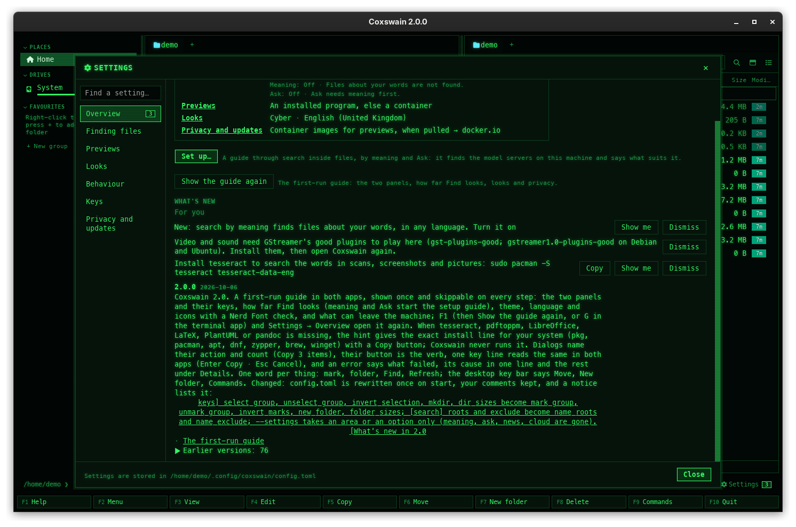

[← README](../../README.md) · [Docs index](../README.md) · [Search](README.md)

# Notices and what's new

The window's title says which version runs. Tips tell you of
search you could turn on and of the git history once you are in a repository, and after an
upgrade you can read what the new version brought. The desktop app counts all of this on its
*Settings* button and lists it under *Settings → Overview → What's new*; the terminal app says one thing at
a time in its status line and has `coxswain --whats-new`. Nothing is shown twice.

## Contents

- [How to use it](#how-to-use-it)
- [What you see](#what-you-see)
- [Settings and config.toml](#settings-and-configtoml)
- [In the terminal app](#in-the-terminal-app)
- [Questions](#questions)


## How to use it

**The title** needs nothing: it reads `Coxswain 1.41.0`, the version. The desktop app sets it
on its window, and on Linux on the title bar GTK draws too (which otherwise kept the title it
was made with). The terminal app sets it as the terminal's title. What can be searched, which
the title also said before 1.41.0, is now the first footer line of
[Find](find-file.md#what-you-see): *563 files indexed · text of 112 files · meaning for 112*.

**What's new, in the desktop app:**

1. Look at **⚙ Settings** at the right of the command line row. A number after it counts the
   tips you have not dismissed plus the versions whose changes you have not read. Its tooltip
   says *Settings · Ctrl+, · What's new: 3, under Overview*.
2. Click it: Settings opens at *Overview*, as **Ctrl+,** does, and *What's new* is there.
   *Overview* in the list on the left shows the same count. `coxswain-gui --settings=overview`
   starts there.
3. Under *For you*, click **Show me** on a tip to go to the Settings area that does it, or
   **Dismiss** to not see it again. Both take it off the list for good.
4. Read the versions below. Click a page name in them to open that page of these docs on GitHub,
   in your browser.
5. **Esc** or **Close** closes Settings.

**What's new, in the terminal app:** after an upgrade the status line says once
`Coxswain 1.29.0 is installed: coxswain --whats-new says what it brought`. Run
`coxswain --whats-new` in a shell.

| Key, click or command | Desktop app | Terminal app |
|---|---|---|
| See what is new | Click **⚙ Settings** while it shows a count | `coxswain --whats-new` |
| Every version | *Earlier versions: 54* under *What's new* folds them open | `coxswain --whats-new all` |
| Act on a tip | **Show me**: opens the right Settings area | Run the command it names |
| Dismiss a tip | **Dismiss** (tooltip *Not shown again*) | Nothing to do: shown once, it counts as seen |
| A problem with search | Click it in the status line: it opens the Settings area; **×** dismisses it | Shown once in the status line |

## What you see



**The Settings button.** *⚙ Settings* with a small number after it, in the accent colour (in
Cyber, a green outline around green figures). No number: nothing new.

**What's new**, the last part of *Settings → Overview*, from top to bottom:

- **For you**: every tip not dismissed, one per row, its text, then **Show me** (when a Settings
  area does it) and **Dismiss**. Not there when no tip is left.
- **The versions you have not read**, newest first: the version in bold, its date, the mark
  *new*, then what it brought in plain words with the docs pages it names as links. When you
  have read them all, the newest version is shown instead, without *new*.
- **Earlier versions: N**, folded: a click opens every older version, back to the first.

The versions come from the changelog at the bottom of the [README](../../README.md#changelog),
built into the app, so *What's new* needs no network and is in English in every language. The docs
links go to GitHub only when you click one. The versions count as read once *What's new* has been in
sight: the count on the button drops, and the *new* marks go next time.

**The tips**, in this order:

| Tip | When | Show me opens |
|---|---|---|
| *Coxswain 2.0 renamed keys in config.toml, your comments kept: [keys] mkdir → new_folder, …* | The first start of 2.0 rewrote a `config.toml` of 1.x, once | *Settings → Keys* ([Renamed in 2.0](../reference/configuration.md#renamed-in-20)) |
| *Search inside files has stopped: …* | A scan of the files failed; nothing further is read, and no vectors come, until one works. Dismissed, it comes back with another reason | *Settings → Finding files* |
| *Start with my session is on, but macOS did not start the search helper, so Coxswain started it until you log out. …* (on Linux: *systemd*) | The system was to start the registered helper and did not within eight seconds, so this app started one. The text says where to allow it (on a Mac: *System Settings → General → Login Items & Extensions → Coxswain → Allow in the Background*) and how to see why (`launchctl print gui/$(id -u)/dk.mwo.coxswain.index`, `helper.log`; `systemctl --user status coxswain-index`) | *Settings → Finding files* ([The search helper](helper.md#start-with-my-session-is-on-but-background-reading-does-not-start-why)) |
| *Search by meaning cannot read what files are about: …* | The server did not answer, or refused (a model that is not pulled) | *Settings → Finding files → Details → Meaning* ([servers](servers.md)) |
| *Coxswain 1.29.0 is installed: coxswain --whats-new says what it brought* | Terminal app only: the first start after an upgrade (not the first start ever). The desktop app counts the version on its button instead | – |
| *New: Ctrl+G on a file or folder in a git repository shows its history, commit by commit* | A folder of a git repository has been opened (the key is yours from `[keys]`) | Nothing: it only tells, so it has **Dismiss** only ([Git history](../panels/git-history.md)) |
| *New: search by meaning finds files about your words, in any language. Turn it on* | Text search is on and has files, and search by meaning is off. Terminal app: *…in any language: coxswain --meaning on* | *Settings → Finding files → Details → Meaning* |
| *Search by meaning now uses your Mac's GPU (Metal): about 6× faster* | The built-in model runs on a Mac's GPU; the factor is what the probe measured when the helper started | *Settings → Finding files → Details → Meaning* ([on a Mac's GPU](meaning.md#on-a-macs-gpu)) |
| *Search by meaning runs on the CPU: …* | On a Mac, the built-in model could not use the GPU, with the reason (*this Mac has no Metal GPU to use*, *the GPU failed: …*). Not shown when you chose *Use the CPU only* | *Settings → Finding files → Details → Meaning* ([on a Mac's GPU](meaning.md#on-a-macs-gpu)) |
| *Ollama runs here: search by meaning could use its GPU. Choose it* | The built-in model is in use, not on a Mac's GPU, and Ollama answers on this machine. Terminal app: *…could use its GPU: coxswain --meaning ollama* | *Settings → Finding files → Details → Meaning* ([servers](servers.md)) |
| *Found OneDrive, Dropbox: files that are only online are found by name only, so nothing is downloaded. Change in Settings* | The helper found files only in the cloud, and `cloud` is not `"all"`. Terminal app: *… cloud = "all" in config.toml reads them* | *Settings → Finding files* ([Cloud files](cloud-files.md)) |
| *Install tesseract to search the words in scans, screenshots and pictures: sudo apt install tesseract-ocr* (the line for this system; without one, the text ends at *pictures*) | Text search is on and the helper found no tesseract. The desktop app adds **Copy** for the line; Coxswain never runs it | *Settings → Finding files* ([Installing what is missing](scans.md#installing-what-is-missing)) |

**Problems in the status line.** The first two, a problem with search, also show in the desktop
app as a button at the right of the command line row, before *⚙ Settings*, with **×** beside it:
a click opens the Settings area. While an [update is available](../reference/updates.md), its
button takes that place and the problem waits. The other tips are never in the status line of the
desktop app.

**Terminal app:** one tip at a time in the status line, once, when no dialog is open and the index
is ready.

A tip dismissed, acted on or (in the terminal app) shown is not shown again, in either app; the
versions read are read in both. Both apps keep this in the shared state file
([What the apps remember](../panels/session.md)).

### `coxswain --whats-new`

```text
$ coxswain --whats-new
1.29.0  2026-10-04
  Search inside files and Ask have keys of their own: Shift+F7 … Find <https://github.com/mwo-dk/coxswain/blob/master/docs/search/find-file.md> · …
```

Each version is a line with its number and date, then its changes on one indented line, emphasis
taken out and each docs link written as the page's name followed by its address on GitHub. It
prints the versions not read yet, or the version you run when there are none, then counts them as
read. `coxswain --whats-new all` prints every version, newest first.

## Settings and config.toml

None. Tips cannot be turned off; each is shown until it is dismissed or acted on in the desktop
app, once in the terminal app. The title cannot be changed. *Settings → Overview → What's new* only shows them.

## In the terminal app

The same tips and title. Differences: there is no count; tips come one at a time in the status
line, once, and name the command instead of a Settings area; after an upgrade a tip points to
`coxswain --whats-new`, which prints the versions in the shell. *Settings → Overview* (**F9** →
*Settings*) lists the tips not shown yet, where **Enter** opens the area that does it, and what
the versions you have not read brought. The title
is the terminal's (a terminal that does not show titles shows nothing).

## Questions

#### What does the number on the Settings button count?
The tips under *For you* that you have not dismissed or acted on, plus the versions after the
one you last read about. Click the button: *What's new* opens, the versions count as read, and the
number drops to the tips that are left. **Dismiss** or **Show me** takes those away.

#### Where did the tips in the status line go?
In the desktop app they moved to *Settings → Overview → What's new*, so the command line row stays quiet
and a tip waits there until you act on it. Only a problem with search (*Search inside files has
stopped: …*, *Search by meaning cannot read what files are about: …*) is still a button in the status line, and
it is in the list as well. The terminal app still shows one tip at a time in its status line.

#### How do I see what an upgrade brought?
Desktop app: click **⚙ Settings** while it shows a number, or *Settings → Overview → What's new*. The
versions you have not read are at the top, marked *new*. Terminal app: `coxswain --whats-new`.

#### How do I read about older versions?
Under *Settings → Overview → What's new*, click *Earlier versions: N*. In a shell, `coxswain --whats-new all`. The same
table is at the bottom of the [README](../../README.md#changelog).

#### Does What's new go on the internet?
No. The changes are built into the app. Only a click on a docs link opens your browser at
GitHub. The [update check](../reference/updates.md) is separate.

#### I dismissed a tip by mistake. Can I get it back?
Not from the app: dismissed tips are remembered in the state file. Each one's action is still
there: *Settings → Finding files → Details → Meaning*, `coxswain --meaning on`, and so on.

#### I use both apps. Will I see each tip twice?
No. Both read and write the same state file, so a tip seen in one is seen in the other. The same
goes for versions: after `coxswain --whats-new`, or the terminal app's upgrade tip, the desktop
app no longer counts that version.

#### Where did "search: names · text" in the title go?
To Find's footer, where it is used: *563 files indexed · text of 112 files · meaning for
112*. *text of* is missing while *Words inside files* is off or the helper cannot be reached;
*meaning for* joins once [search by meaning](meaning.md) runs.

#### The title on Linux used to say just "Coxswain". Why the change?
GTK's title bar kept the title the window was made with. The desktop app now sets that bar's title
too, so the version shows on Linux as on macOS and Windows.

#### Why did the Ollama tip appear?
Search by meaning runs on the built-in model on your CPU, and Ollama answered on
`http://localhost:11434`. It could make the vectors on its GPU, much faster: see
[servers](servers.md).

---
[← Previous: Battery](battery.md) · [Next: Search settings →](settings.md)
