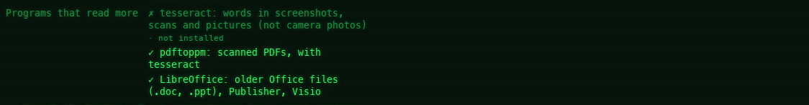

[← README](../../README.md) · [Docs index](../README.md) · [Search](README.md)

# Scans, pictures and older Office files

Some files have words only an installed program can get: screenshots, scans, scanned PDFs, and
older Office files such as `.doc` and `.ppt`. When the program is there, Coxswain uses it by itself,
and a search finds those words too.

## How to use it

1. Install the program (table below).
2. Wait for the [search helper](helper.md)'s next scan, within ten minutes, or click **Read
   now** under *Settings → Finding files*: the helper looks for the programs at every scan.
3. The files of that kind are then read again, by themselves. Search them as any
   [text](text.md): **Shift+F7**, your words.

| Program | Reads | Notes |
|---|---|---|
| `tesseract` (OCR) | The words in screenshots, scans and pictures: `.png` `.jpg` `.jpeg` `.jpe` `.tif` `.tiff` `.webp` `.bmp` | Photos from a camera (a JPEG whose EXIF names the camera maker) are skipped: they seldom have words and there are thousands. It reads English and your system's language, when tesseract has them |
| `pdftoppm` (with tesseract) | Scanned PDFs, which hold pictures of pages instead of text | Up to 30 pages, at 200 dpi, in grey. Only a PDF with no text of its own |
| LibreOffice (`soffice`) | Older Office files and others no reader here knows: `.doc` `.dot` `.wps` `.wpd` `.pub` `.ppt` `.pps` `.pot` `.vsd` `.vsdx` `.odg` `.sxw` `.sxi` `.sxd` `.lwp` `.pages` `.key` | Made into a PDF in a temporary folder, read, and removed. It has its own profile, so a LibreOffice you have open is not disturbed |

How to install each one on your system: [Installing what is missing](#installing-what-is-missing).
Coxswain shows the same line where a program is missing.

For other languages than English and yours, install tesseract's language data too
(`tesseract-ocr-deu`, `tesseract-data-deu` …).

## Installing what is missing

Where a program is missing, Coxswain shows the command that installs it on this system, with a
**Copy** button. It never runs the command: you paste it into a shell. The package manager is
the system's own: `pkg` on FreeBSD, `pkgin` on NetBSD, `pkg_add` on OpenBSD, `pkg` on illumos, Homebrew on a Mac, `winget` on Windows, and on Linux the
first of `pacman`, `apt`, `dnf` and `zypper` that is installed.

| System | tesseract | pdftoppm | LibreOffice |
|---|---|---|---|
| FreeBSD | `pkg install tesseract` | `pkg install poppler-utils` | `pkg install libreoffice` |
| NetBSD (`pkgin`) | `pkgin install tesseract` | `pkgin install poppler-utils` | `pkgin install libreoffice` |
| OpenBSD (`pkg_add`) | `pkg_add tesseract` | `pkg_add poppler-utils` | `pkg_add libreoffice` |
| illumos (`pkg`) | none in OmniOS | none | none |
| Arch (`pacman`) | `sudo pacman -S tesseract tesseract-data-eng` | `sudo pacman -S poppler` | `sudo pacman -S libreoffice-fresh` |
| Debian, Ubuntu (`apt`) | `sudo apt install tesseract-ocr` | `sudo apt install poppler-utils` | `sudo apt install libreoffice` |
| Fedora (`dnf`) | `sudo dnf install tesseract` | `sudo dnf install poppler-utils` | `sudo dnf install libreoffice` |
| openSUSE (`zypper`) | `sudo zypper install tesseract-ocr` | `sudo zypper install poppler-tools` | `sudo zypper install libreoffice` |
| macOS (Homebrew) | `brew install tesseract` | `brew install poppler` | `brew install --cask libreoffice` (`/Applications/LibreOffice.app` is looked in) |
| Windows (`winget`) | `winget install --id UB-Mannheim.TesseractOCR -e` (`C:\Program Files\Tesseract-OCR` is looked in) | none: *pdftoppm has no package here: get it from its website and put it on PATH.* (poppler for Windows) | `winget install --id TheDocumentFoundation.LibreOffice -e` (`C:\Program Files\LibreOffice\program` is looked in) |

Where it shows:

| Where | Desktop app | Terminal app |
|---|---|---|
| *Settings → Finding files → Details → What is read → Programs that read more* | Each missing program: *not installed*, then *Install it:* with the line and **Copy** (*Copied* beside it after the click) | *Settings → Finding files → Programs that read more*: the row shows `✓`, or the line. **Space** on it copies the line to the terminal's clipboard (OSC 52); the bottom says *Copied: …* |
| The tesseract [notice](notices.md) | *Install tesseract to search the words in scans, screenshots and pictures: sudo apt install tesseract-ocr*, under *Settings → Overview → What's new*, with **Copy** | The same text, once in the status line |

Without a package manager Coxswain knows (a Linux with none of the four), there is no line: the
notice says *Install tesseract to search the words in scans, screenshots and pictures* and the
row says *not installed*.

## What you see

*Settings → Finding files → Details → What is read → Programs that read more* lists the three, each with ✓ or ✗:

- *tesseract: words in screenshots, scans and pictures (not camera photos)*
- *pdftoppm: scanned PDFs, with tesseract*
- *LibreOffice: older Office files (.doc, .ppt), Publisher, Visio*

A missing one adds *· not installed* and the line that installs it, with **Copy**
([above](#installing-what-is-missing)). While tesseract is missing and text search is on, both
apps show the [notice](notices.md) *Install tesseract to search the words in scans, screenshots
and pictures: …* with the line for this system: the desktop app under *Settings → Overview →
What's new* until dismissed, with **Copy**; the terminal app once in its status line.

A hit from a picture shows the words tesseract read, as any text hit does. OCR is not perfect:
a word may be read wrong, and then it is found only as it was read.

## Settings and config.toml

None of its own. The programs are found on `PATH` (and in the usual install folders on Windows and
macOS). They run at the lowest priority the system offers, with a time limit of two minutes a
file. The usual limits apply: `text_max_size` (20 MB) and the [folders read](folders.md).

## In the terminal app

The same: the helper reads for both apps. **F9** → *Settings* → *Finding files* lists the
programs under *Programs that read more*: `✓`, or `✗` with the line that installs it, which
**Space** copies to the terminal's clipboard (OSC 52, over ssh too). The tesseract notice shows
in its status line, with the line in it.

## Questions

#### How do I get the words in my screenshots found?
Install tesseract and, for scanned PDFs, poppler's `pdftoppm`. When the helper next starts it finds
them and reads the pictures again. **Read now** in Settings reads the backlog at full speed.

#### A notice says to install tesseract. How?

The notice ends with the command for your system, such as `sudo apt install tesseract-ocr`. In the
desktop app click **Copy** next to it (*Settings → Overview*), paste it into a terminal and run
it. In the terminal app, **F9** → *Settings* → *Finding files*, the cursor on tesseract under
*Programs that read more*, **Space** copies it. Then wait for the helper's next scan, or click
**Read now**. All the lines: [Installing what is missing](#installing-what-is-missing).

#### Why does Coxswain not install it for me?

Installing needs your password and changes the system; that is yours to decide. Coxswain only
writes the line and copies it when you ask.

#### There is no line, only "get it from its website". Why?

The package manager here has no package for it, such as poppler (`pdftoppm`) for `winget`, or
the system has none of the package managers Coxswain knows. Get the program from its own site
and put its folder on `PATH`.

#### I installed tesseract and nothing happened.
The helper looks for the programs once, when it starts. Close every Coxswain window and wait ten
minutes, or make any change under *Settings → Finding files*. With the helper started with
your session, untick and tick *Start with my session* under *Details → Background reading* (or run
`coxswain --index-service off` and `on`). The ✓ in Settings shows it was found.

#### Why are my holiday photos not read?
A JPEG whose EXIF names the camera maker is a photo, and photos are skipped on purpose: they seldom
have words and there are thousands.

#### Does it read my scanned PDFs page by page?
The first 30 pages, turned into pictures at 200 dpi by `pdftoppm` and read by tesseract. Only a PDF
with no text of its own is handled so.

#### Will reading pictures slow my machine?
The programs run at the lowest priority, one file at a time, with rests between batches, and not
on [battery](battery.md). The first pass over many pictures takes a while; Settings counts
them as *waiting* on the *Words* line.

#### Does LibreOffice need to be closed?
No. It runs with a profile of its own, so the LibreOffice you have open is not touched.

#### Is anything sent anywhere to be read?
No. The programs run on your machine, into a temporary folder that is removed afterwards.

---
[← Previous: Documents it reads](documents.md) · [Next: Diagrams read as sentences →](diagrams.md)
