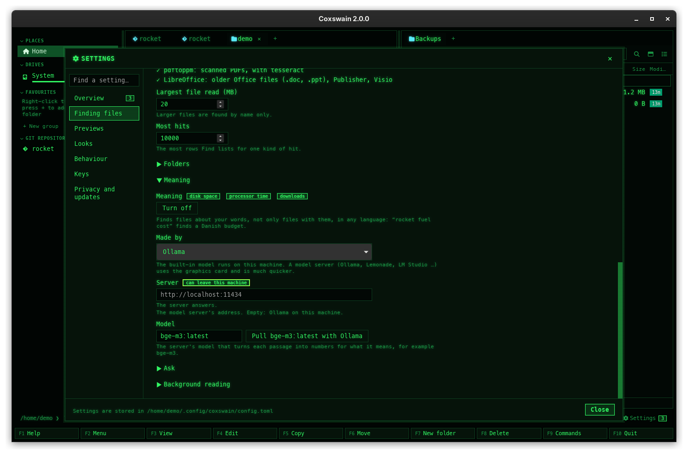

[← README](../../README.md) · [Docs index](../README.md) · [Search](README.md)

# Search by meaning on a server: Ollama, Lemonade, LM Studio

The built-in model needs nothing but is slow on a laptop's CPU. If you run
[Ollama](https://ollama.com) or a server with the OpenAI API ([Lemonade](https://lemonade-server.ai),
LM Studio, llama.cpp, vLLM, LocalAI, OpenAI itself), it can make the vectors for
[search by meaning](meaning.md) instead, on its GPU or NPU, with a bigger model.

The guided setup finds the servers on this machine and what their models can do, says which suits
your hardware, and sets it all: [Smart search in a few minutes](setup.md) (**Set up…** in
Settings, or `coxswain --setup-search`). It has a section per server, with the models to use.



## How to use it

| | Desktop app: *Settings → Search by meaning → Vectors made by* | Terminal app |
|---|---|---|
| Ollama on this machine | *Ollama*. The model `bge-m3` (multilingual, 1.2 GB) is suggested; when the server lacks it, **Pull bge-m3 with Ollama** fetches it, with a progress bar | `coxswain --meaning ollama [MODEL]`: `bge-m3` unless named, pulled when missing (*Pulling bge-m3 with Ollama…*) |
| Ollama elsewhere | *Ollama*, *Server* `http://evo:11434` | `meaning_url = "http://evo:11434"` in `config.toml`, with `meaning_engine = "ollama"` |
| Lemonade, LM Studio, … | *A server with the OpenAI API (Lemonade, LM Studio, llama.cpp …)*, *Server* `http://localhost:8000/api/v1` (Lemonade's), then its *Embedding model* from the list | `coxswain --meaning server URL MODEL`, e.g. `coxswain --meaning server http://localhost:8000/api/v1 nomic-embed-text-v1-GGUF` |
| Back to the built-in model | *Built-in model, on this machine (465 MB once)* | `coxswain --meaning builtin` (downloads the model if it is not there) |

Then turn it on, if it is not: **Turn on** in Settings. The terminal commands turn it on
themselves. The *Server* field is the base URL: Coxswain adds `/api/embed` for Ollama and
`/embeddings` for the OpenAI API (and `/api/tags` or `/models` to list the models).

## What you see

- Settings asks the server for its models whenever you change the engine or the server, and says
  *The server answers.*, or why not (the error). The *Embedding model* field offers the models it
  listed.
- **A server on another machine gets the text of your files**: the passages that get vectors, and
  every question. Settings says so, in bold: *The text of your files is sent to evo to get its
  vectors.* A server on `localhost`, `127.0.0.1` or `::1` gets no such warning; nothing leaves the
  machine.
- For the OpenAI API, *API key from the variable* names an environment variable (placeholder
  `OPENAI_API_KEY`) whose value is sent as the key. The key itself is never written into
  `config.toml`.
- The status line shows the model in use, `ollama:bge-m3` or `openai:nomic-embed-text-v1-GGUF`, and
  in red the error of a server that does not answer.
- While search by meaning runs on the built-in model and Ollama answers on this machine, a
  [notice](notices.md) says *Ollama runs here: search by meaning could use its GPU. Choose it*
  under *Settings → What's new* (terminal app: `… : coxswain --meaning ollama`, once in the
  status line).

## What to know

- **Another model makes them all again.** Vectors of two models cannot be compared, so switching
  model or server replaces every vector, in the background; search by words goes on meanwhile.
  Before it is saved, Settings says what it costs, for example *Changing the embedding model
  re-reads the meaning of 3437 files (about 2 hours on this machine).*, with **Change and
  re-read** and **Keep the current model**; `coxswain --meaning ollama|server|builtin` prints the
  same and asks *Go on? [y/N]*. The time comes from the new model making the vectors of one long
  file. The same model written another way (`bge-m3` and `bge-m3:latest`), or the same weights
  under another name on Ollama, is no change: the vectors stay.
- **A server that does not answer** pauses search by meaning: Settings, the terminal app's Find
  file and a [notice](notices.md) show the error (*No vectors: …*), the files
  wait, and they are done at the next pass once it answers. A search asks the server for the
  question's vector too, so while it is down, meaning hits are missing; word hits are not.
- **Prefixes.** Models whose name has `e5` get `query: ` and `passage: ` in front, and
  `nomic-embed` models `search_query: ` and `search_document: `, as those models want.
- **What counts as close** depends on the model: e5 models need a score of 0.77, other models 0.5,
  and always within a tenth of the best hit.
- **To clean up:** *Turn off*, or go back to the built-in model. Coxswain installs nothing on a
  server; a model it pulled goes with `ollama rm bge-m3`.

## Settings and config.toml

Under `[search]`:

| Settings item | Key | Type | Default |
|---|---|---|---|
| *Vectors made by* | `meaning_engine` | `"builtin"`, `"ollama"` or `"openai"` | `"builtin"` |
| *Server* | `meaning_url` | string | `""`: Ollama on this machine, `http://localhost:11434` |
| *Embedding model* | `meaning_model` | string | `""`: `bge-m3` for Ollama; must be set for the OpenAI API |
| *API key from the variable* (OpenAI API only) | `meaning_key_env` | string, a variable's name | `""` |
| *Turn on* / *Turn off* | `meaning` | bool | `false` |

```toml
[search]
meaning = true
meaning_engine = "openai"
meaning_url = "http://evo:8000/api/v1"
meaning_model = "nomic-embed-text-v1-GGUF"
meaning_key_env = "LEMONADE_KEY"
```

## In the terminal app

`coxswain --meaning ollama [MODEL]`, `--meaning server URL MODEL` and `--meaning builtin` write
the keys and start the helper again; `--meaning server` first checks that the server answers,
with the key `meaning_key_env` names when one is set, as the model lists in Settings do. For
Ollama on another machine, or an API key, edit `config.toml`. The warning about text sent to
another machine is shown only in the desktop app's Settings; see [Privacy](../reference/privacy.md).

## Questions

#### Which model should I pick on a server?
A multilingual embedding model, if your files are in several languages: `bge-m3` is the
suggestion. Any embedding model the server offers works; chat models do not.

#### Does `coxswain --meaning ollama` work with Ollama on another machine?
It talks to Ollama on this machine. For another one, set `meaning_url = "http://evo:11434"` under
`[search]` (or use Settings).

#### Is a server faster than the built-in model?
Usually much faster: a GPU or NPU makes vectors for thousands of passages in the time the CPU makes
a few. The helper still rests between batches and waits on battery, as with the built-in model.

#### Why does Settings say the text of my files is sent somewhere?
The *Server* is not this machine. To make vectors, the server must read the passages, and your
questions. Use a server you trust, or one on `localhost`.

#### My server wants an API key. Where does it go?
In an environment variable; name that variable under *API key from the variable*
(`meaning_key_env`). The variable must be set where the search helper starts: in your session, or in
the systemd unit or LaunchAgent when the helper [starts with your session](helper.md). The key
goes only to the saved *Server*. Over `http://` it travels unencrypted, as do your passages:
use `https://` for a server on another machine.

#### Why does switching the model start over?
Vectors of two models cannot be compared. The store remembers which model made them, and when that
changes every file gets new ones. You are asked first, with the number of files and about how long it takes.
Picking `bge-m3:latest` from the list for `bge-m3` is not a switch: Ollama's missing tag counts as
`:latest`, and Ollama's digest of the weights is compared too.

#### The server was off for a while. Do I have to do anything?
No. Files wait while it does not answer, and are done once it does.

#### Why is there no "Delete the model" button for a server?
The model lives on the server, not in Coxswain. Remove it there, for example `ollama rm bge-m3`.

---
[← Previous: Search by meaning](meaning.md) · [Next: Ask →](ask.md)
