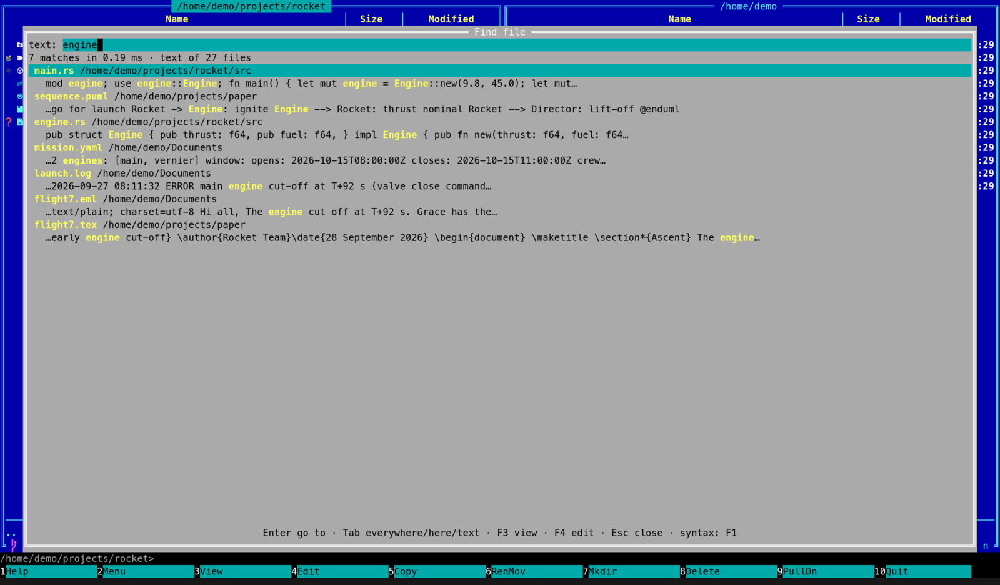

[← README](../../README.md) · [Docs index](../README.md) · [Search](README.md)

# Text in files

Text in files finds the files whose text has your words: code, notes, PDFs, Word documents,
spreadsheets, slides, mail and books. Use it when you remember what a file says but not what it
is called.

*Seven files with "engine" in them: code, a PlantUML diagram, YAML, a log, a mail and a LaTeX paper.*

## Contents

- [How to use it](#how-to-use-it)
- [How words match](#how-words-match)
- [What you see](#what-you-see)
- [What is read, and when](#what-is-read-and-when)
- [Settings and config.toml](#settings-and-configtoml)
- [In the terminal app](#in-the-terminal-app)
- [Questions](#questions)

## How to use it

1. Open [Find file](find-file.md): **Alt+F7** or **Ctrl+F**.
2. Press **Tab** twice. The prompt is `text: ` (terminal app); the *Text in files* button is
   highlighted (desktop app). Or click *Text in files*.
3. Type words: `rocket budget`. Best matches come first.
4. **Enter** goes to the file, **F4** edits it, **F3** views it (terminal app).

## How words match

- **Every word must be there**, anywhere in the file, in any order.
- **The last word may be the start of one**, so `rocket bud` finds "rocket budget" while you type.
  The other words are whole words.
- **Case and accents do not matter**: `cafe` finds "Café".
- **Punctuation separates words**, so `fuel_cost` is the words "fuel" and "cost".
- The [name syntax](name-syntax.md) (`!`, `|`, `ext:`) does not apply here, and quotes are ignored.
- With [search by meaning](meaning.md) on, files *about* your words follow the files that have them.

## What you see

**Before you type:** *Type words to search inside your files: text, PDF, Word, spreadsheets,
slides, mail and books.* While search by meaning is off, also *Also find files about your words,
in any language:* with the link *turn on search by meaning* (desktop app) or `coxswain --meaning on`
(terminal app).

**The count line:** `7 matches in 2.4 ms · text of 31,208 files · 412 still to read`. The last part
shows only while the helper still has files to read.

**Each hit:** the name, its folder, and the passage that matched (up to 18 words around your
words, with `…` where it is cut), your words highlighted. A hit found by meaning shows
*similar to:* and the start of the passage that was close.

**Nothing to search:** with *Search inside files* off, or the [helper](helper.md) not running, text
finds nothing; *Settings → Search inside files* says *The search helper is not running, so text
cannot be searched now.*

## What is read, and when

| | |
|---|---|
| **Which folders** | Your home folder, unless you choose others ([Choosing the folders](folders.md)) |
| **Which files** | Anything that is plain text (code, Markdown, logs, configuration …), the [documents](documents.md) Coxswain reads, [diagrams](diagrams.md) as sentences, the files [inside archives](archives.md), and with installed programs, [scans and older Office files](scans.md). Up to 20 MB each (`text_max_size`), and at most 4 MB of text from one file |
| **Left out** | Hidden folders (names starting with a dot); folders named `node_modules`, `target`, `build`, `dist`, `out`, `vendor`, `__pycache__` or `Trash` (`text_exclude`); folders marked *Names only*; any folder holding a file named `.nosearch`; pictures, video and other files without text; symbolic links; files locked with a password, inside archives too |
| **When** | In the background, by the [search helper](helper.md): a batch of files, then a rest as long as the work took (at most two seconds), so it runs at about half speed. Not while a laptop is on its [battery](battery.md). Changes are read within seconds |
| **Also kept** | Every file's size and date, and the total of each folder left out, so [folder sizes](../panels/folder-sizes.md) are sums; the hashes of files that share a size, for [Duplicates](../files/duplicates.md) |
| **Where** | `search.db` in Coxswain's cache folder, readable by you alone ([Where things are kept](../reference/where-things-are-kept.md)) |

Coxswain reads the documents itself, starting no other program (except the
[optional ones](scans.md) you install), and no reader touches the network. A file that cannot be
read (damaged, locked, not what its name says) is marked as without text and tried again when it
changes.

**Following changes.** The helper follows the file watcher: it collects changes for two seconds,
then reads the files that changed. A change inside a folder left out is measured for folder sizes
within a minute. A walk every ten minutes catches anything the watcher missed.

## Settings and config.toml

*Settings → Search inside files* (desktop app); `[search]` in `config.toml`. Every item is in
[Search settings](settings.md).

| Key | Type | Default | Does |
|---|---|---|---|
| `text` | bool | `true` | *Keep the text of files, so Find file can search in it (Tab)* |
| `text_roots` | list of paths | `[]` (your home folder) | *Folders read* |
| `text_exclude` | list of strings | `["node_modules", "target", "build", "dist", "out", "vendor", "__pycache__", "Trash"]` | Folder names left out, wherever they are |
| `names_only` | list of paths | `[]` | *Names only* |
| `text_max_size` | bytes | `20971520` (20 MB) | Larger files are not read |
| `archives` | bool | `true` | *Search inside archives*: the files in zip, 7z and tar archives are read too ([Inside archives](archives.md)) |

## In the terminal app

The same store, the same hits, found by the same helper. The passage goes on a second line under
each name, your words in the `search_hit` colour. There is no Settings window: set the keys in
`config.toml`, and the helper takes them at its next start ([questions](folders.md#questions)).

## Questions

#### Why doesn't a file I just saved show up in text search?
It is read within seconds of the save, if all of these hold:

- It is inside a [folder that is read](folders.md) (your home folder by default), and not in a
  folder left out (hidden, `node_modules`, `target` …, names only, `.nosearch`).
- It is a kind with text, and no larger than 20 MB.
- The machine is not on its [battery](battery.md): reading waits for the mains.
- The helper is not still reading a backlog: the count line says ` · 412 still to read`, and the
  new file waits its turn. *Index now* in Settings reads the backlog at full speed.

#### Why does `budge` not find "budgets"?
Only the last word may be a start; the others must be whole words. Put the partial word last, or
type it in full.

#### Text search finds nothing at all.
Check *Settings → Search inside files*: the box must be ticked, and the status must not say *The
search helper is not running, so text cannot be searched now.* Right after the first start the
store is still being filled: ` · 31,000 still to read` counts down.

#### Can I search the text in one folder only?
No: text search covers every folder read. The folder under each hit shows where it is.

#### Does anything leave my machine?
Not for search by words: the text stays in `search.db` on your disk. Search by meaning with the
built-in model stays on the machine too; with a [server on another machine](servers.md) the text is
sent to it. See [Privacy](../reference/privacy.md).

#### How big does `search.db` get?
About the size of the text in your files, plus a little for each file known. Settings shows it:
*Searchable: 31,208 files · still to read: 0 · 412 MB on disk*.

#### How do I start the index afresh?
*Settings → Search inside files → Delete the index*, then click again (*Click again to delete*). It
empties `search.db`, sizes, hashes and vectors included, and the helper fills it again from the
start. Or delete `search.db` while no Coxswain runs.

#### Why is only part of a very large file found?
At most 4 MB of text is kept from one file, and a very long PDF is read for three seconds. Words
past that are not in the store.

---
[← Previous: Name syntax](name-syntax.md) · [Next: Documents it reads →](documents.md)
